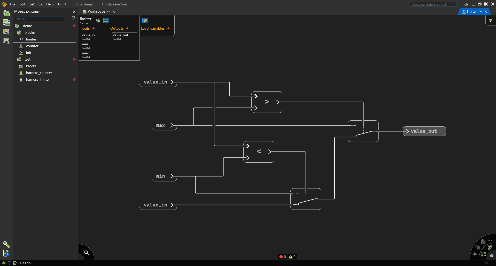
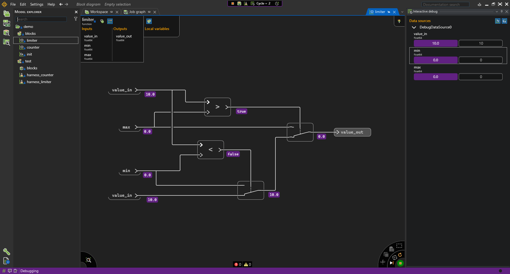
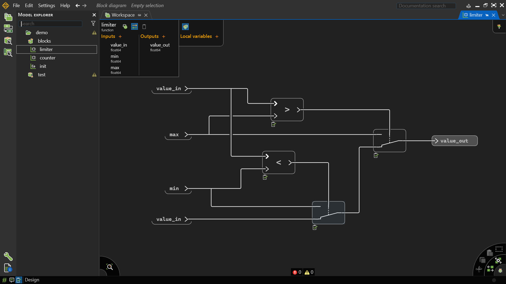
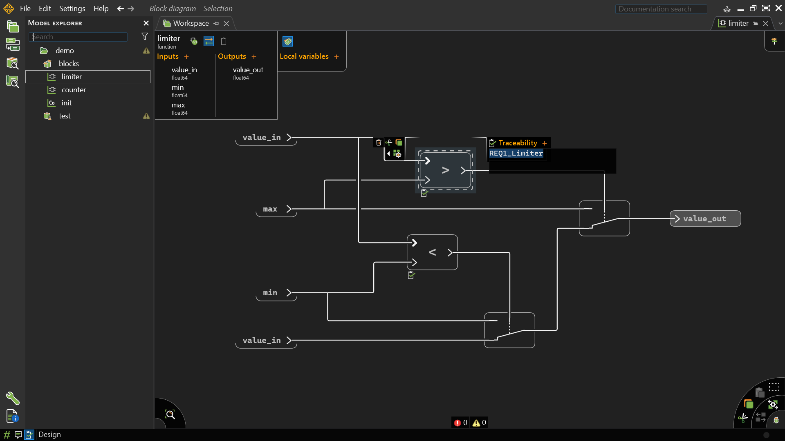
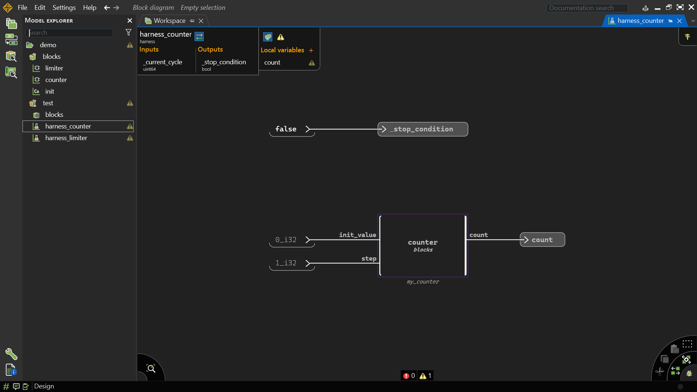
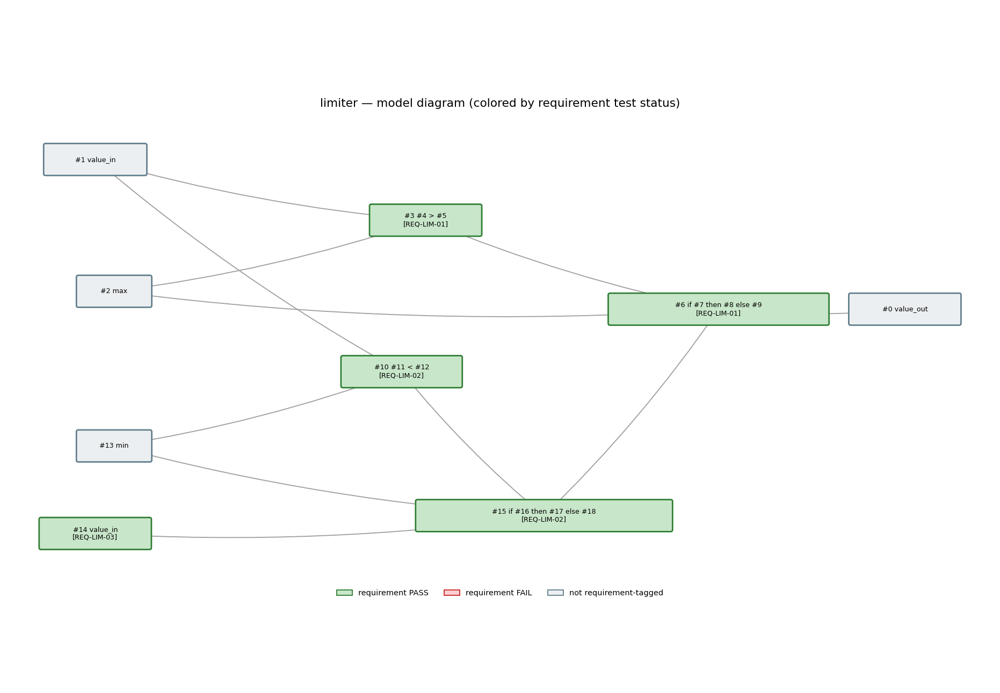
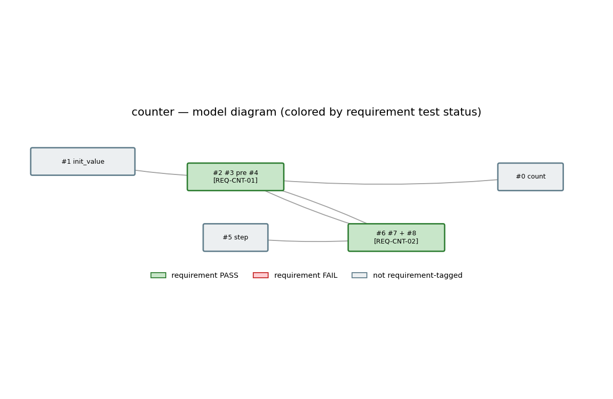

# Lab 3 — Software Requirements Engineering, Scade One &amp; Traceability

**Course:** Software Engineering  
**Lesson:** From System Intent to Traceable Software Requirements  
**Duration:** 4–6 hours (can be split across sessions — a natural break point is after Part 6)  
**Tool:** Ansys Scade One Student Edition (Parts 2–7, 9) + pen/paper or a text editor (Parts 1, 8)  
**Work mode:** Individual  
**Recommended prerequisite:** [Lab 2 — Applying the SDLC (Python)](../lab2/) (informal system description, decision table, REQ-01…REQ-06)

---

# Context

In Lab 2 you wrote requirements as plain "SHALL" sentences:

> *"If the brake is pressed, the system shall deactivate cruise control."*

That's already better than nothing, but free-form "SHALL" prose is easy to write ambiguously — it doesn't force you to say *when* a requirement applies, *what triggers* it, or *what state* the system must be in for it to hold. Two engineers can read the same informal sentence and design two different behaviors from it.

**EARS (Easy Approach to Requirements Syntax)** is a small set of sentence templates that removes that ambiguity, without needing a formal specification language. Each requirement is written in exactly one of five shapes, chosen by what *kind* of behavior it describes: always-on, triggered by an event, only in a certain state, a response to something going wrong, or an optional feature.

This lab also introduces **Model-Based Design (MBD)** with **Scade One**. Unlike traditional programming, in MBD:
- systems are designed graphically
- the model itself is executable
- testing is integrated into the design workflow
- code can later be generated automatically
- **requirements can be linked directly to the model elements that implement them** — this is the traceability mechanism you will use throughout this lab

You will write EARS software requirements for two small components — a **Limiter** (combinatorial logic) and a **Counter** (sequential logic) — then build each one in Scade One and link your requirements to the model, so you learn requirements engineering, Scade One modeling, and traceability together, on examples small enough to see the whole chain end to end. You will also write the software requirements for the **Cruise Control system**, which you model and trace in [Lab 4](../lab4/).

| Type | Meaning |
|---|---|
| **Combinatorial Logic** | Output depends only on current inputs |
| **Sequential Logic** | Output depends on previous states/history |

| Component | Modeled in this lab | What it does |
|---|---|---|
| **Limiter** | Part 2–3 | Clamps a value to `[min, max]` |
| **Counter** | Part 4–5 | Accumulates a step value each cycle |
| **Cruise Control** | Requirements only here — modeled in [Lab 4](../lab4/) | State machine + PI regulator + limiter, reusing Lab 2's design |

> **Reference:** Ansys' course *["EARS method to write clear system requirements"](https://innovationspace.ansys.com/courses/courses/development-of-adas-functions-with-ansys-scade/lessons/lesson-1-ears-method-to-write-clear-system-requirements/)* is written for **SCADE** (the older, Simulink-style tool), not **Scade One** (the tool used in this course). Its screenshots and menu paths won't match what you see in Scade One — read it only for the EARS syntax itself, not the tool workflow.

---

# Learning Objectives

By the end of this lab you will be able to:

- Recognize the five EARS requirement patterns and pick the right one for a given behavior
- Rewrite an informal "SHALL" sentence as a precise EARS requirement
- Derive a complete software requirements set for a small component from its informal description
- Create Scade One projects, modules, and operators with typed interfaces
- Implement combinatorial logic (the Limiter) and sequential logic using delays (`pre`) (the Counter)
- Simulate models and build automated test harnesses
- Link a requirement ID to a model element via Scade One's Requirements panel, and explain what that link actually writes into the `.swan` source
- Explain, precisely (not just "there's a link somewhere"), how a REQ ID stays traceable from requirement → design element → test case
- Turn a single requirement into a concrete test case (input sequence + expected result), in the same shape Lab 4's evaluation script consumes

---

# Prerequisites

### 1 — Install Scade One Student Edition

Download and install the free student version:

**→ [Ansys SCADE Student Free Software Download](https://www.ansys.com/academic/students/ansys-scade-student)**


> The student edition does not require any registration or license activation — it is ready to use once installed.

### 2 — Complete the QuickStart tutorial

Before starting this lab, watch and follow the official quickstart:

**→ [Scade One Student — Quick Getting Started (YouTube)](https://www.youtube.com/watch?v=ww5-sx8U0lc)**

This covers: creating a project, declaring inputs/outputs, drawing a state machine, and running the simulator. You will need all of these in this lab.

---

# Part 1 — The EARS Patterns

---

## Theory

EARS defines five requirement shapes. Every requirement is exactly one of these — if you find yourself blending two, split it into two requirements.

| # | Pattern | Template | Use when… |
|---|---|---|---|
| 1 | **Ubiquitous** | `The <system> shall <response>.` | The behavior holds at all times, unconditionally |
| 2 | **Event-driven** | `WHEN <trigger>, the <system> shall <response>.` | A specific event causes the response |
| 3 | **State-driven** | `WHILE <state>, the <system> shall <response>.` | The response only applies during a state/mode |
| 4 | **Unwanted behavior** | `IF <condition>, THEN the <system> shall <response>.` | An undesired or abnormal condition must be handled |
| 5 | **Optional feature** | `WHERE <feature is included>, the <system> shall <response>.` | The response only applies if an optional feature is present |

A sixth shape, the **complex requirement**, chains several triggers/states with `AND`:

```text
WHILE <state> AND WHEN <trigger>, the <system> shall <response>.
```

### Worked example

Informal (Lab 2 style):

> *"If the brake is pressed, the system shall deactivate cruise control."*

As EARS (**unwanted behavior** — brake-pressed is an abnormal/unsafe condition to be in while active):

> **IF** the brake is pressed, **THEN** the Cruise Control system **shall** deactivate.

Compare to an **event-driven** requirement for the same system, which reads differently on purpose:

> **WHEN** the driver presses the `on` button, the Cruise Control system **shall** transition from `cc_disabled` to `cc_enabled`.

The difference matters: "IF brake pressed THEN deactivate" must hold *regardless of current state* (even if already disabled — deactivating an already-disabled system is a no-op, but the rule still applies), while "WHEN on pressed" only makes sense as a transition *out of* `cc_disabled`. Picking the right pattern forces you to think about exactly this.

---

## Activity 1A — Classify These

<style>
  .quiz-widget { margin-top: 1rem; }
  .quiz-q { margin-bottom: 1.1rem; padding: 1.15rem 1.25rem; background: var(--white); border: 1px solid var(--border); border-radius: 8px; }
  .quiz-q strong { display: block; margin-bottom: .7rem; color: var(--navy); font-size: .97rem; }
  .quiz-option { display: flex; align-items: flex-start; gap: .55rem; padding: .42rem .55rem; border-radius: 5px; cursor: pointer; transition: background .13s; user-select: none; font-size: .92rem; }
  .quiz-option:hover { background: var(--ice); }
  .quiz-option input { margin-top: .22rem; flex-shrink: 0; accent-color: var(--blue); }
  .quiz-option.correct { background: #E8F5E9; color: #1B5E20; font-weight: 600; border-radius: 5px; }
  .quiz-option.wrong   { background: #FFEBEE; color: #B71C1C; text-decoration: line-through; border-radius: 5px; }
  .quiz-option.reveal  { background: #FFF8E1; color: #BF360C; font-weight: 600; border-radius: 5px; }
  .quiz-submit { margin-top: .75rem; padding: .55rem 1.5rem; background: var(--blue); color: var(--white); border: none; border-radius: 6px; font-size: .9rem; font-weight: 600; cursor: pointer; transition: background .15s; }
  .quiz-submit:hover:not(:disabled) { background: var(--sky); }
  .quiz-submit:disabled { opacity: .45; cursor: default; }
  .quiz-score { display: inline-block; margin-left: 1rem; font-size: 1rem; font-weight: 700; vertical-align: middle; }
  .quiz-reset { display: none; margin-left: .75rem; padding: .55rem 1.1rem; background: transparent; color: var(--muted); border: 1px solid var(--border); border-radius: 6px; font-size: .88rem; cursor: pointer; transition: color .15s, border-color .15s; vertical-align: middle; }
  .quiz-reset:hover { color: var(--blue); border-color: var(--sky); }
</style>

For each informal sentence below, pick the EARS pattern that fits best.

<div id="ears-pattern-quiz" class="quiz-widget">
  <div class="quiz-q" data-name="a1q1" data-correct="ubiq">
    <strong>1. "The counter's output must never be negative."</strong>
    <label class="quiz-option"><input type="radio" name="a1q1" value="ubiq"><span>Ubiquitous</span></label>
    <label class="quiz-option"><input type="radio" name="a1q1" value="event"><span>Event-driven</span></label>
    <label class="quiz-option"><input type="radio" name="a1q1" value="state"><span>State-driven</span></label>
    <label class="quiz-option"><input type="radio" name="a1q1" value="unwanted"><span>Unwanted behavior</span></label>
    <label class="quiz-option"><input type="radio" name="a1q1" value="optional"><span>Optional feature</span></label>
  </div>
  <div class="quiz-q" data-name="a1q2" data-correct="event">
    <strong>2. "WHEN the driver presses the <code>on</code> button, the Cruise Control system shall transition from <code>cc_disabled</code> to <code>cc_enabled</code>."</strong>
    <label class="quiz-option"><input type="radio" name="a1q2" value="ubiq"><span>Ubiquitous</span></label>
    <label class="quiz-option"><input type="radio" name="a1q2" value="event"><span>Event-driven</span></label>
    <label class="quiz-option"><input type="radio" name="a1q2" value="state"><span>State-driven</span></label>
    <label class="quiz-option"><input type="radio" name="a1q2" value="unwanted"><span>Unwanted behavior</span></label>
    <label class="quiz-option"><input type="radio" name="a1q2" value="optional"><span>Optional feature</span></label>
  </div>
  <div class="quiz-q" data-name="a1q3" data-correct="state">
    <strong>3. "While the system is calculating, it should show a loading indicator."</strong>
    <label class="quiz-option"><input type="radio" name="a1q3" value="ubiq"><span>Ubiquitous</span></label>
    <label class="quiz-option"><input type="radio" name="a1q3" value="event"><span>Event-driven</span></label>
    <label class="quiz-option"><input type="radio" name="a1q3" value="state"><span>State-driven</span></label>
    <label class="quiz-option"><input type="radio" name="a1q3" value="unwanted"><span>Unwanted behavior</span></label>
    <label class="quiz-option"><input type="radio" name="a1q3" value="optional"><span>Optional feature</span></label>
  </div>
  <div class="quiz-q" data-name="a1q4" data-correct="optional">
    <strong>4. "Where the vehicle has adaptive cruise control installed, the system shall automatically adjust the set speed to maintain distance from the car ahead."</strong>
    <label class="quiz-option"><input type="radio" name="a1q4" value="ubiq"><span>Ubiquitous</span></label>
    <label class="quiz-option"><input type="radio" name="a1q4" value="event"><span>Event-driven</span></label>
    <label class="quiz-option"><input type="radio" name="a1q4" value="state"><span>State-driven</span></label>
    <label class="quiz-option"><input type="radio" name="a1q4" value="unwanted"><span>Unwanted behavior</span></label>
    <label class="quiz-option"><input type="radio" name="a1q4" value="optional"><span>Optional feature</span></label>
  </div>
  <div>
    <button class="quiz-submit" type="button">Check Answers</button>
    <button class="quiz-reset" type="button">Try Again</button>
    <span class="quiz-score"></span>
  </div>
</div>

> **Why Q2 isn't "unwanted behavior":** pressing `on` is the *normal, expected* way to start the system — nothing is wrong or abnormal about it. `IF/THEN` is reserved for conditions you don't want to happen (brake pressed while active, overspeed), not for ordinary user actions.

---

# Part 2 — Requirements &amp; Design: The Limiter

---

## Requirements

`limiter(value_in, min, max) -> value_out` — clamps `value_in` to `[min, max]`.

### Worked example

> **REQ-LIM-01** — IF `value_in` is greater than `max`, THEN the Limiter shall set `value_out` to `max`.

### Activity 2A — Write REQ-LIM-02 and REQ-LIM-03

Using the same **unwanted behavior** pattern as REQ-LIM-01:

- **REQ-LIM-02** — the clamp-to-minimum case.
- **REQ-LIM-03** — the pass-through case (`value_in` already inside `[min, max]`). Think about whether "unwanted behavior" (`IF`) is really the right pattern here, or whether **ubiquitous** fits better — pass-through isn't an abnormal condition, it's the normal case.

---

## Design

### Theory

A **combinatorial system** computes outputs only from current inputs. There is no memory, no previous state, no delay.

Equivalent software example for a limiter function:

```python
if value > max_value:
    output = max_value
elif value < min_value:
    output = min_value
else:
    output = value
```

This type of logic is frequently used for: saturation, validation, range checking, signal conditioning.

### Activity 2B — Create a Swan Module

Inside your project: `New → Swan Module`, name it `blocks`. This module will contain reusable operators — both the Limiter and the Counter (Part 4) live here.

### Activity 2C — Create the Limiter Operator

Inside `blocks`: `New → Operator`, name it `limiter`.

### Activity 2D — Define the Interface

Add the following:

| Name | Type | Direction |
|---|---|---|
| `value_in` | `float64` | Input |
| `min` | `float64` | Input |
| `max` | `float64` | Input |
| `value_out` | `float64` | Output |

### Activity 2E — Implement the Logic

To implement this in Scade One, use comparison blocks (`>`, `<`), conditional/switch blocks, and direct signal connections. Your completed model should resemble: upper branch → saturation at maximum, lower branch → saturation at minimum, otherwise pass-through.



#### Understanding Definition vs Expression


When right-clicking in a Scade diagram, you will frequently use `Definition` and `Expression` — the two most important modeling elements.

| Element | Use it for |
|---|---|
| **Expression** | Computations and values |
| **Definition** | Named outputs/signals |

Use **Expression** when you want constants (defined by value and data type) or intermediate computations that don't need a name:

```text
0_i32
0.0_f64
```

Think: `"A value"`.

#### Instance blocks

Operators like arithmetic, comparisons, and delays are **instance blocks**, not expressions — an instance block instantiates an operator that processes flows.

```text
+
-
>
<
pre
```

Think: `"Process a flow"`.

Use **Definition** when you want an output, a local variable, or a named signal. Think: `"Store or expose a result"`.

### Activity 2F — Simulate the Model

Switch to simulation mode: Start debug session (F5), or click the button in the bottom right corner.



Test the following values against your REQ-LIM-01..03:

| value_in | min_value | max_value | Expected value_out | Requirement exercised |
|---|---|---|---|---|
| 5 | 0 | 10 | 5 | REQ-LIM-03 |
| 20 | 0 | 10 | 10 | REQ-LIM-01 |
| -5 | 0 | 10 | 0 | REQ-LIM-02 |

If there are any errors or warnings, fix type mismatches, unconnected signals, or undefined references.

---

## Traceability

### Activity 2G — Link REQ-LIM-01 to the Limiter

Scade One can link a requirement ID directly to a model element via the **Requirements** panel (bottom-left button in the diagram editor — enable traceability editing mode).

1. Select the `limiter` operator (or, more precisely, its diagram-level definition — the `function` declaration) — or, as shown below, an individual diagram element such as the `value_in > max` comparison block, if you want the link to point at the specific equation rather than the whole operator (Scade One supports both).
2. Right-click the element and open the **Traceability** panel that appears.
3. Click **+** and type the requirement ID — for this activity, `REQ-LIM-01`.
4. Confirm the link — Scade One highlights the association in the panel.

<!-- <p float="left">
  
  
</p> -->

  

You've now created your first real traceability link. Part 9 explains exactly what this action writes into the underlying `.swan` source, and why the *exact spelling* of the ID you type here matters.

---

# Part 3 — Test Harness for the Limiter

---

## Theory

A **Test Harness** is a test environment around an operator. It injects inputs (predefined), executes the model, observes outputs, and automates testing.

### Activity 3A — Create Test Module

Create a module: `test`.

### Activity 3B — Import the Blocks Module

Inside `test`, add: `use blocks` (Add actions (+) > Create use directive).

### Activity 3C — Create Harness

Create: `New → Harness`, name it `limiter_harness`.

### Activity 3D — Add Operator Under Test

Drag `limiter` into the harness diagram. Connect constants:

| Signal | Value_type |
|---|---|
| `value_in` | `120.0_f64` |
| `min_value` | `0.0_f64` |
| `max_value` | `100.0_f64` |


Select the operator instance. Enable `Operator under test`.


> `_stop_condition` is implicitly `false` by default — you don't need to connect anything to it.

### Activity 3E — Run the Harness

Run simulation: Start debug session (F5), Step (F9), click on the model to open it: Open (Enter).

Expected output: `value_out = 100.0` — this is REQ-LIM-01 (input exceeds maximum, limiter saturates output), now demonstrated automatically instead of by hand.

---

# Part 4 — Requirements &amp; Design: The Counter

---

## Requirements

`counter(init_value, step) -> count`, where `count` starts at `init_value` and adds `step` every cycle after that.

Notice this component is **sequential** — its behavior depends on which cycle you're in, so a plain ubiquitous requirement can't capture it correctly. You need two requirements: one for "the first cycle," one for "every cycle after."

### Worked example

> **REQ-CNT-01** — WHEN the Counter is initialized (first cycle), the Counter shall set `count` to `init_value`.

### Activity 4A — Write REQ-CNT-02

Write the **event-driven** requirement for every cycle after the first — the accumulation behavior (`count` of this cycle = `count` of the previous cycle + `step`).

---

## Design

### Theory

A **sequential system** depends on current inputs *and* previous outputs/state. Sequential systems require memory, delays, state variables.

Scade One uses `pre` — the delay operator — and `->` — the **initial value** operator, giving the value used on the first cycle only — for stateful behavior. Combined as the binary `pre` (e.g. `0 pre x`), this is the **initialized delay**: it outputs the initial value on the first cycle, then the previous value of `x` afterwards.

### Activity 4B — Create the Counter Operator

Inside `blocks`: `New → Operator`, name it `counter`.

### Activity 4C — Define the Interface

Add:

| Name | Type | Direction |
|---|---|---|
| `init_value` | `int32` | Input |
| `step` | `int32` | Input |
| `count` | `int32` | Output |

### Activity 4D — Implement Sequential Logic


Behavior — this is REQ-CNT-01 and REQ-CNT-02 from the Requirements section above, expressed graphically:

```python
count = previous_count + step
```

Use `pre`, `+`, initialized delay. Equivalent Scade equation:

```text
count = init_value -> pre(count) + step
```

or equivalently:

```text
old_count = init_value -> pre(count)
count = old_count + step
```

### Activity 4E — Simulate

Use `init_value = 0`, `step = 1`. Run multiple cycles: Step (F9).

Expected behavior:

| Cycle | Count | Requirement exercised |
|---|---|---|
| 0 | 0 | REQ-CNT-01 |
| 1 | 1 | REQ-CNT-02 |
| 2 | 2 | REQ-CNT-02 |
| 3 | 3 | REQ-CNT-02 |

---

## Traceability

### Activity 4F — Link REQ-CNT-01 and REQ-CNT-02 to the Counter

Repeat Activity 2G's procedure for the `counter` operator: open the Requirements panel, add entries for `REQ-CNT-01` and `REQ-CNT-02`, and link them to the `counter` operator (or, if your Scade One version supports linking at the equation level, to the specific equation each requirement describes — the initial-value branch for REQ-CNT-01, the accumulation branch for REQ-CNT-02).

---

# Part 5 — Test Harness for the Counter

---

### Activity 5A — Create Harness

Create: `counter_harness` inside the `test` module.



### Activity 5B — Add Operator Under Test

Drag and drop the `counter` block into the harness. Connect:

| Signal | Value |
|---|---|
| `init_value` | `0_i32` |
| `step` | `1_i32` |

Enable `Operator under test` for the counter instance.

> `_stop_condition` is implicitly `false` by default — you don't need to connect anything to it.

### Activity 5C — Run Sequential Simulation

Execute multiple cycles. Observe the counter value increasing at each cycle — the operator now has memory/state.

---

# Part 6 — Comparing Combinatorial vs Sequential Logic

---

| Feature | Combinatorial | Sequential |
|---|---|---|
| Depends on current inputs | Yes | Yes |
| Depends on previous state | No | Yes |
| Uses memory | No | Yes |
| Uses `pre` | No | Yes |
| Uses delays | No | Yes |
| Example | Limiter | Counter |
| Requirement shape needed | Usually one ubiquitous/unwanted-behavior requirement per branch | Usually at least two requirements (first-cycle + steady-state) |

---

# Part 7 — Python Test Script

---

Scade One can generate C code from your model and expose it via a Python wrapper. This lets you test both operators programmatically — reproducing the simulation steps from Parts 2 and 4 as automated, repeatable tests, printing the REQ IDs each test exercises, running against your own generated project via `--project-dir` (Activity 7F), and generating a requirement-coverage CSV plus a pass/fail-colored model diagram (Activity 7G) — a small custom stand-in for the traceability reporting Scade One Student Edition doesn't provide out of the box.

**Reference:** [Testing Scade One models with Python](https://innovationspace.ansys.com/knowledge/forums/topic/testing-scade-one-models-with-python/)

### Activity 7A — Create and Run a Code Generation Job

Code generation in Scade One is done through a **Job**, not a menu command. You need one job per operator root.


**For the `limiter`:**

1. Open the **Job Explorer** panel (left sidebar)
2. Right-click your project → **New Job → Code Generation**
3. Name it e.g. `CodeGenerationJob_limiter`
4. In the **Code Generation Properties** panel (right side), set **Root declarations** to `blocks::limiter`
5. Click **Run** (▶) — the job graph shows the flow: `blocks` module → `CodeGenerationJob` → Generated code
6. Wait for status to show **Completed**


**For the `counter`:**

Repeat the same steps, setting **Root declarations** to `blocks::counter`.

The generated code appears in the job's output folder (click the **Generated code** node in the job graph to open it). It contains `limiter_blocks.c`, `limiter_blocks.h` (and equivalent for counter) plus supporting files like `swan_types.h`.

> The Python bridge loads this generated C code at runtime — the job must have completed successfully before running any Python tests.

### Activity 7B — Generate the Python Wrapper

After the code generation job completes (Activity 7A), use `PythonWrapper` to build a Python-callable DLL from the generated C code.

**Install the required Python package first:**

```text
pip install ansys-scadeone-core==0.8.2
```

Or using a `requirements.txt`:

```text
# requirements.txt
ansys-scadeone-core==0.8.2
```

```text
pip install -r requirements.txt
py -3 -m pip install -r requirements.txt --user
```

Then create `setup_wrapper.py` in your project folder:

```python
# setup_wrapper.py
# Run this once to generate Python-callable wrappers for both operators.

from pathlib import Path
from ansys.scadeone.core import ScadeOne
from ansys.scadeone.core.svc.pywrapper.python_wrapper import PythonWrapper

SCADE_INSTALL = r"C:\Program Files\Ansys Inc\v261\Scade One Student\Scade One"
PROJECT_DIR   = r"path\to\your\demo.sproj"

app = ScadeOne(install_dir=SCADE_INSTALL)
prj = app.load_project(PROJECT_DIR)
prj.load_jobs()

# Each operator gets its own output name so they don't overwrite each other.
# The job name is a string — do NOT pass prj.get_job(...) here.
PythonWrapper(prj, "CodeGenerationJob_limiter", output="limiter_wrapper").generate()
PythonWrapper(prj, "CodeGenerationJob_counter", output="counter_wrapper").generate()

print("Wrappers generated.")
```

Run it once:

```text
python setup_wrapper.py
```

This produces:
- `limiter_wrapper/limiter_wrapper.py` — contains class `limiter_blocks`
- `counter_wrapper/counter_wrapper.py` — contains class `counter_blocks`

> **Class naming:** the generated class name is `<module>_<operator>` — e.g. the `limiter` operator inside the `blocks` module becomes `limiter_blocks`. Open the generated `.py` file to confirm the exact class name before writing tests.

### Activity 7C — Limiter Test Script

Inputs and outputs are **direct attributes** on the generated object. The cycle method is `.cycle()`. Each test tuple below carries the REQ ID it exercises — the same "test tuple carries a `req` field" pattern from Lab 2, now applied to a generated model instead of hand-written Python.

Create `test_limiter.py`:

```python
# test_limiter.py
# Tests the generated limiter operator against REQ-LIM-01..03.
# Run setup_wrapper.py first.

import argparse
import sys
from pathlib import Path

parser = argparse.ArgumentParser()
parser.add_argument("--project-dir", "-d", type=Path, default=Path(__file__).parent,
                     help="Folder containing limiter_wrapper/ (default: this script's folder)")
args = parser.parse_args()

sys.path.insert(0, str(args.project_dir / "limiter_wrapper"))
from limiter_wrapper import limiter_blocks  # class is <module>_<operator>

lim = limiter_blocks()

test_cases = [
    # (value_in, min, max, expected_out, req)
    ( 5.0,  0.0, 10.0,  5.0, "REQ-LIM-03"),   # pass-through
    (20.0,  0.0, 10.0, 10.0, "REQ-LIM-01"),   # clamp at max
    (-5.0,  0.0, 10.0,  0.0, "REQ-LIM-02"),   # clamp at min
]

all_passed = True
for value_in, min_v, max_v, expected, req in test_cases:
    lim.reset()
    lim.inputs.value_in, lim.inputs.min, lim.inputs.max = value_in, min_v, max_v
    lim.cycle()
    result = lim.outputs.value_out
    status = "PASS" if abs(result - expected) < 1e-9 else "FAIL"
    if status == "FAIL":
        all_passed = False
    print(f"  [{req:10s}] in={value_in:6.1f}  min={min_v:.1f}  max={max_v:.1f}"
          f"  → expected={expected:.1f}  got={result:.1f}  {status}")
```

`--project-dir` is explained in Activity 7F — the default (no argument) just runs against `limiter_wrapper/` next to the script, exactly as before.

### Activity 7D — Counter Test Script

The counter is **sequential** — do not reset between steps. Run four consecutive `.cycle()` calls and observe the accumulating count:

```python
# test_counter.py
# Tests the generated counter operator against REQ-CNT-01..02.
# Run setup_wrapper.py first.

import argparse
import sys
from pathlib import Path

parser = argparse.ArgumentParser()
parser.add_argument("--project-dir", "-d", type=Path, default=Path(__file__).parent,
                     help="Folder containing counter_wrapper/ (default: this script's folder)")
args = parser.parse_args()

sys.path.insert(0, str(args.project_dir / "counter_wrapper"))
from counter_wrapper import counter_blocks

cnt = counter_blocks()

# (cycle, expected, req)
expected_sequence = [(0, 0, "REQ-CNT-01"), (1, 1, "REQ-CNT-02"),
                      (2, 2, "REQ-CNT-02"), (3, 3, "REQ-CNT-02")]

cnt.reset()  # reset once — do NOT reset between cycles
all_passed = True
for cycle_n, expected, req in expected_sequence:
    cnt.inputs.init_value, cnt.inputs.step = 0, 1
    cnt.cycle()
    result = cnt.outputs.count
    status = "PASS" if result == expected else "FAIL"
    if status == "FAIL":
        all_passed = False
    print(f"  [{req:10s}] Cycle {cycle_n}  expected={expected}  got={result}  {status}")
```

> **Note on the counter:** `reset()` puts the operator back to its initial state (the `->` value). Each `.cycle()` call then advances the internal `pre` register — this is what makes it different from the limiter, which has no memory.

### Activity 7E — Run and Evaluate

```text
python test_limiter.py
python test_counter.py
```

> **API note:** The exact class name and instantiation method depend on your Scade One version and project name — check the generated wrapper file. The pattern above follows the `ansys.scadeone.core` API documented at the [reference link](https://innovationspace.ansys.com/knowledge/forums/topic/testing-scade-one-models-with-python/).

### Activity 7F — Running Tests Against Your Own Project

`test_limiter.py`/`test_counter.py` default to looking for `limiter_wrapper/`/`counter_wrapper/` **next to the script itself** — that's why the plain `python test_limiter.py` above just works from inside `src/lab3/starter/` or `src/lab3/solution/`. But you don't have to run your own model from inside this repo's folder layout: pass `--project-dir` (or `-d`) to point the script at wherever you generated (or copied/uploaded) your own project's `blocks.swan` + wrapper folders instead:

```text
python test_limiter.py --project-dir path\to\your\project
python test_counter.py --project-dir path\to\your\project
```

`path\to\your\project` should contain the same layout `setup_wrapper.py` produces: `limiter_wrapper/` (with `limiter_wrapper.py` + the built `.dll`), `counter_wrapper/`, and either `assets/blocks.swan` or a flat `blocks.swan`. This is useful once you're iterating on your *own* Limiter/Counter design — say, after changing the clamp logic or adding a requirement — without needing to overwrite the files that ship with this repo: keep your working copy anywhere, and just point `--project-dir` at it.

**Try it right here, without installing anything:** the **Requirement Traceability Checker** widget at the bottom of this page runs entirely in your browser (no upload to any server) and checks just the `#pragma requirement` links in a `blocks.swan` file you paste or upload — the same check `test_limiter_advanced.py`/`test_counter_advanced.py` print before their test loop. It's a quick way to sanity-check Activity 2G/4F's links from your phone or a machine without Python installed.

> **What it can't do:** the widget only reads `blocks.swan` as text — it cannot run your actual generated model. That model is a compiled native `.dll` (Activity 7B), and no browser-based Python (this page uses [Skulpt](https://skulpt.org/), the same engine Lab 2's live editor uses) can execute a native OS binary inside a browser sandbox — that's a hard platform limit, not a missing feature. For real PASS/FAIL results against your own generated wrapper, run `test_limiter.py`/`test_counter.py` locally as in Activity 7E (optionally with `--project-dir`, per above).

### Activity 7G — Visualizing Requirement Coverage (custom traceability add-on)

Scade One **Student Edition** doesn't ship a requirement-coverage report or a way to view the model colored by pass/fail — the Requirements panel (Activities 2G/4F) only shows you links one element at a time, and there's no built-in "run the tests, then show me the result on the diagram" workflow. `test_limiter_advanced.py`/`test_counter_advanced.py` build a small custom version of that themselves, entirely from two ingredients Part 9 already introduced: the `#pragma requirement` text in `blocks.swan`, and the pass/fail result of each test case. They accept the same `--project-dir` flag as the simple scripts above.

Before running any cycles, each advanced script re-opens `blocks.swan` as plain text and scans it for the `#pragma requirement <ID> #end` annotations Activity 2G's Requirements panel wrote — printing, for each expected REQ ID, which numbered diagram node it resolves to (or `NOT TRACED` if the link is missing, which is exactly what you'd see if you ran this before completing Activity 2G/4F). Then, after the cycle-by-cycle assertions, it:

1. **Aggregates a PASS/FAIL status per requirement** — a REQ ID is `FAIL` if *any* of its test cases failed, `PASS` otherwise.
2. **Writes a traceability CSV** (`results/limiter_traceability.csv`, `results/counter_traceability.csv`, under `--project-dir`) — one row per test case, same shape as Lab 4's `results/summary.csv`:

   | tid | req | nodes | inputs | expected | actual | status |
   |---|---|---|---|---|---|---|
   | TC-LIM-01 | REQ-LIM-03 | #14 (value_in) | value_in=5.0, min=0.0, max=10.0 | 5.0 | 5.0 | PASS |
   | TC-LIM-02 | REQ-LIM-01 | #3 (#4 > #5); #6 (if #7 then #8 else #9) | value_in=20.0, min=0.0, max=10.0 | 10.0 | 10.0 | PASS |
   | TC-LIM-03 | REQ-LIM-02 | #10 (#11 < #12); #15 (if #16 then #17 else #18) | value_in=-5.0, min=0.0, max=10.0 | 0.0 | 0.0 | PASS |

3. **Renders the model diagram** (`results/limiter_diagram.png`, `results/counter_diagram.png`) using `matplotlib` — one box per diagram node (positioned using the same `"xy":"H..;V.."` coordinates Scade One itself stores in `blocks.swan`, so the layout roughly matches what you see in the Scade One editor), wired together per the `wire` statements, and colored by the status of the requirement it's linked to:

<p float="left">
  
  
</p>

Green = the requirement linked to that node passed every test case that exercised it. Red = at least one test case failed. Gray = no `#pragma requirement` link at all (an ordinary, untraced diagram node — most of them will be gray; that's expected, not every node corresponds to a requirement).

Run them the same way, optionally against your own project:

```text
python test_limiter_advanced.py
python test_counter_advanced.py
# or, against your own generated project:
python test_limiter_advanced.py --project-dir path\to\your\project
```

Both PASS/FAIL and CSV/diagram generation are independent: if `matplotlib` isn't installed, the script still runs and prints PASS/FAIL as before, just with a one-line note that the diagram was skipped (`pip install matplotlib`, or add it to `requirements.txt` as already listed).

> **Why this matters pedagogically:** this is exactly the kind of tooling gap a real project has to fill itself when its student/evaluation-tier IDE doesn't include a requirements-management add-on. The traceability *data* (`#pragma requirement` in the source, pass/fail from the test) was already there — Part 9 showed you where. What's new here is turning that data into an artifact a reviewer can actually look at without opening Scade One at all.

---

# Part 8 — Requirements for the Cruise Control System

---

Everything so far (Parts 2–7) was practiced on two small components. This part scales the same requirements-writing skill up to the system you will actually **model** in [Lab 4](../lab4/) — the Cruise Control system from Lab 2.

## System recap

Lab 2's informal description, unchanged:

> *"Cruise control must be safe. It should stop when needed, should not start in dangerous conditions, and if it stops for a safety reason the driver must be aware that they need to restart it manually."*

Lab 2 gave you six requirements: REQ-01, REQ-02, REQ-03, REQ-04 (functional) and REQ-05, REQ-06 (non-functional). The Scade One model you build in Lab 4 implements REQ-01, REQ-02, and REQ-04 — **REQ-03 (refuse to activate below 30 km/h) is not modeled there**, so it's out of scope for this lab too; don't rewrite it. The Scade One model also contains two pieces of behavior Lab 2's Python version didn't need to state explicitly, because they only exist once you separate the **regulator** and **limiter** into their own model elements: the regulation behavior itself, and the fact that the regulator's throttle output is clamped (the exact same clamping shape as REQ-LIM-01..03 above — the regulator reuses your Limiter design). Give those new IDs — REQ-07 and REQ-08 — continuing Lab 2's sequence rather than starting a new prefix, since they describe the same system.

## Worked example

Lab 2's REQ-01 rewritten as EARS (**unwanted behavior**):

> **REQ-01** — IF the brake is pressed, THEN the Cruise Control system shall deactivate (transition to `cc_disabled` or `cc_standby`, per the state table).

### Activity 8A — Rewrite REQ-02 and REQ-04 as EARS

Look up REQ-02 (overspeed) and REQ-04 (reactivation requires an explicit action) in [Lab 2's requirements](../lab2/). Rewrite each as an EARS requirement. Decide the pattern yourself — REQ-02 is the same shape as REQ-01; REQ-04 is **state-driven** (it only applies *while* suspended).

### Activity 8B — Write REQ-07 and REQ-08 (new for this model)

- **REQ-07** — the regulator's job: **while** cruise control is active, what should the throttle output do relative to `set_point`? (state-driven)
- **REQ-08** — the regulator's throttle output must stay inside a safe range. (ubiquitous — this is exactly REQ-LIM-01..03's pattern, reused, because the regulator internally reuses the Limiter operator you built in Part 2.)

### Activity 8C — Sanity-check against the state table

Lab 2 and Lab 4 both carry a state-transition table (`cc_disabled`/`cc_enabled`/`cc_active`/`cc_standby`). For each of your REQ-01, REQ-02, REQ-04 rewrites, find the row(s) in that table the requirement corresponds to. If a requirement doesn't map to any row, either the requirement or the table is incomplete — figure out which.

> **Keep these REQ IDs exactly as spelled** (`REQ-01`, `REQ-02`, `REQ-04`, `REQ-07`, `REQ-08`) — [Lab 4](../lab4/) references them by that literal string, not by description. You will trace them to the actual `cruise_control` model in Lab 4, Activity 7A, using the same Requirements-panel mechanism you just practiced in Activities 2G and 4F — Part 9 below explains exactly how that mechanism works under the hood.

---

# Part 9 — How Traceability Works in Scade One

---

Activities 2G and 4F had you click through the Requirements panel to link `REQ-LIM-01` and `REQ-CNT-01/02` to your models. This part explains **what that click actually did**, using the real source files from this course as evidence — not a hypothetical example.

## The mechanism: `#pragma requirement`

Scade One's Requirements panel doesn't store links in a separate database — it writes them directly into the `.swan` source, as a `#pragma requirement <ID> #end` annotation immediately before the element it's attached to. For an operator, that means right before the `function`/`node` keyword's parameter list.

The general shape (using your Activity 2G link as the pattern) is:

```text
function #pragma requirement REQ-LIM-01 #end limiter (value_in: float64; min: float64; max: float64;)
  returns (value_out: float64;)
{ ... }
```

## A real example, from this repository

You don't have to take this on faith — here is the **actual, unedited line** from `CC_design.swan`, the reference Cruise Control model you'll build in Lab 4:

```swan
node #pragma requirement reQ2 #end cruise_control (v_speed:float32; ...)
```

This is exactly the mechanism described above: the Requirements panel attached a requirement ID (`reQ2`) to the `cruise_control` node. Scade One resolves traceability project-wide by scanning for these pragmas — there's no central "traceability matrix" file it maintains; the matrix, if you want one, has to be built by collecting these annotations (which is exactly what Activity 8C-style state-table cross-checks and Lab 4's Activity 7A table do by hand).

## The gap this reveals

Look closely at that real excerpt again: the ID is `reQ2`, not `REQ-02`. **Scade One does not validate the pragma's text against your requirements document** — it's just a string. A typo, a casing slip, or an inconsistent naming convention (as happened here — `reQ2` instead of the canonical `REQ-02` used everywhere else in this course, including your own Activity 8A answer) will not raise an error. The link will *look* present in the Requirements panel, but it silently fails to match anything a human — or a script — searching for `REQ-02` would find.

**This is not a hypothetical warning — it's the actual state of the reference model you'll be working from in Lab 4.** Take it as your first lesson in traceability discipline: after you link a requirement in the Requirements panel, always double-check the ID you typed matches your canonical spelling *exactly*, character for character. A traceability link that "exists" but doesn't match anyone's search is worse than an honest, visible gap — it creates false confidence.

## From a requirement to a test case

The second half of traceability is the link forward to a **test**, not just to a design element. "Verified by a script" isn't automatic — someone has to read the requirement and design a concrete input sequence that would fail if the requirement were violated. In [Lab 4](../lab4/), that test artifact is a row (or short run of rows) in a scenario CSV consumed by `evaluate_cc_full_report.py`.

`evaluate_cc_full_report.py` drives the model cycle-by-cycle from a CSV with columns `cycle, on, set, v_speed, brake, accel, res, set_point, expected_throttle, req, note`. Two of those columns are where a requirement becomes a test:

- **`req`** — which requirement this row is evidence for. This is the literal traceability link: it's how a results summary can later report "REQ-01: PASS" instead of just "row 3: PASS."
- **`expected_throttle`** — the value the requirement says must come out, *if* the requirement pins down an exact number. Not every requirement does (REQ-07's "regulate toward `set_point`" is a converging process, not a single value — those rows are left blank and checked visually via a chart instead).

### Worked example — REQ-01

> **REQ-01** — IF the brake is pressed, THEN the Cruise Control system shall deactivate.

To test this, you need a moment where the system *is* active, then press the brake, then check it left the active state. As a scenario:

| cycle | on | brake | accel | expected_throttle | req | note |
|---|---|---|---|---|---|---|
| 1 | True | 0.0 | 0.300 | *(blank — regulating)* | — | cc_active, regulator running |
| 2 | True | 15.0 | 0.300 | 0.300 | **REQ-01** | brake pressed → must leave cc_active; throttle now mirrors accel |

Row 2 is the actual test of REQ-01: the requirement says "IF brake pressed THEN deactivate," so the row sets `brake > 10.0` and asserts the *consequence* of deactivation — throttle falls back to mirroring `accel`, the same behavior as `cc_disabled`/`cc_standby`. Tag that row `req = REQ-01`. This is exactly what Lab 4's `tc03_brake_suspends.csv` does — you're looking at the reference implementation of this same derivation.

### Activity 9A — Derive a test case for REQ-07

> **REQ-07** — WHILE Cruise Control is active, the regulator shall drive `throttle` toward `set_point`.

Sketch (in words or as a short table, like the one above) a scenario that would exercise REQ-07:
- What state must the system be in first?
- What sequence of `v_speed` values would show the throttle actually *converging* toward `set_point`, rather than just producing some non-zero number?
- Since REQ-07 doesn't pin down one exact `expected_throttle` value, what column should carry the `REQ-07` tag instead — and how would you check the requirement was met without a hardcoded expected value?

## Requirements, design, and tests — the full map

| Your REQ ID | Design element | Traced (Requirements panel) | Verified by |
|---|---|---|---|
| REQ-LIM-01..03 | `limiter` operator | Activity 2G (you did this already) | `limiter_harness` (Part 3) + `test_limiter.py` (Part 7), coverage CSV + diagram via `test_limiter_advanced.py` (Activity 7G) |
| REQ-CNT-01..02 | `counter` operator | Activity 4F (you did this already) | `counter_harness` (Part 5) + `test_counter.py` (Part 7), coverage CSV + diagram via `test_counter_advanced.py` (Activity 7G) |
| REQ-01, REQ-02, REQ-04 | `cruise_control` state machine | [Lab 4, Activity 7A](../lab4/#activity-7a-traceability-in-scade-one) | Lab 4's `evaluate_cc_full_report.py` scenario checkpoints (`req` column) |
| REQ-07, REQ-08 | `regulator` node (reuses `limiter`) | Lab 4, Activity 7A | Lab 4's `evaluate_cc_full_report.py`, checked visually via the throttle chart |

A requirement only becomes traceable once both of those last two columns are filled in for it — not before.

---

# Common Errors

---


## Undefined Reference

Cause: missing `use blocks;`.

## Missing Operator Under Test

Cause: not configured. Fix: select operator, enable `Operator under test`.

## Undetermined Literal Type

Incorrect: `0`. Correct: `0_i32` / `0.0_f64`.

## Invalid Delay Initialization

Cause: incorrect `pre` usage. Correct form: `x = init -> pre(x)`.

## Requirement ID Doesn't Match Anything

Cause: as shown in Part 9, a typo or casing mismatch between the pragma text and your canonical REQ ID spelling (`reQ2` vs `REQ-02`). Scade One won't flag this — it's a silent gap, not a build error. Fix: re-open the Requirements panel and correct the ID text to match your requirements document exactly.

---

# Reflection Questions

<div id="reflection-quiz" class="quiz-widget">
  <div class="quiz-q" data-name="q1" data-correct="c">
    <strong>1. Which EARS pattern fits "IF the brake is pressed, THEN the system shall deactivate cruise control"?</strong>
    <label class="quiz-option"><input type="radio" name="q1" value="a"><span>Ubiquitous</span></label>
    <label class="quiz-option"><input type="radio" name="q1" value="b"><span>State-driven</span></label>
    <label class="quiz-option"><input type="radio" name="q1" value="c"><span>Unwanted behavior</span></label>
    <label class="quiz-option"><input type="radio" name="q1" value="d"><span>Optional feature</span></label>
  </div>
  <div class="quiz-q" data-name="q2" data-correct="b">
    <strong>2. "WHILE cruise control is suspended, the system shall require an explicit resume action before returning to active" — why WHILE and not WHEN?</strong>
    <label class="quiz-option"><input type="radio" name="q2" value="a"><span>WHEN is reserved for hardware-triggered events only</span></label>
    <label class="quiz-option"><input type="radio" name="q2" value="b"><span>The requirement describes behavior that holds for as long as the system is in a specific state, not a single instantaneous trigger</span></label>
    <label class="quiz-option"><input type="radio" name="q2" value="c"><span>WHILE and WHEN are interchangeable in EARS</span></label>
    <label class="quiz-option"><input type="radio" name="q2" value="d"><span>Because the requirement has no trigger at all</span></label>
  </div>
  <div class="quiz-q" data-name="q3" data-correct="d">
    <strong>3. Why does the Counter need two separate requirements (REQ-CNT-01, REQ-CNT-02) instead of one ubiquitous requirement?</strong>
    <label class="quiz-option"><input type="radio" name="q3" value="a"><span>EARS requires at least two requirements per component</span></label>
    <label class="quiz-option"><input type="radio" name="q3" value="b"><span>Ubiquitous requirements are forbidden for sequential systems</span></label>
    <label class="quiz-option"><input type="radio" name="q3" value="c"><span>The Counter has two inputs, so it needs two requirements</span></label>
    <label class="quiz-option"><input type="radio" name="q3" value="d"><span>Its behavior differs between the first cycle and every cycle after, so a single "always true" statement can't describe it precisely</span></label>
  </div>
  <div class="quiz-q" data-name="q4" data-correct="a">
    <strong>4. In Scade One, what does linking a requirement in the Requirements panel actually do?</strong>
    <label class="quiz-option"><input type="radio" name="q4" value="a"><span>Writes a <code>#pragma requirement &lt;ID&gt; #end</code> annotation into the .swan source, right before the linked element</span></label>
    <label class="quiz-option"><input type="radio" name="q4" value="b"><span>Stores the link in a separate traceability database, invisible in the source files</span></label>
    <label class="quiz-option"><input type="radio" name="q4" value="c"><span>Validates the ID against your requirements document and rejects typos</span></label>
    <label class="quiz-option"><input type="radio" name="q4" value="d"><span>Automatically generates a test case for that requirement</span></label>
  </div>
  <div class="quiz-q" data-name="q5" data-correct="c">
    <strong>5. The real <code>CC_design.swan</code> file tags <code>cruise_control</code> with <code>reQ2</code> instead of <code>REQ-02</code>. What does this demonstrate?</strong>
    <label class="quiz-option"><input type="radio" name="q5" value="a"><span>Scade One's pragma syntax requires lowercase letters</span></label>
    <label class="quiz-option"><input type="radio" name="q5" value="b"><span>REQ-02 was intentionally renamed to reQ2 for this model</span></label>
    <label class="quiz-option"><input type="radio" name="q5" value="c"><span>Scade One doesn't validate pragma text against your requirements document, so a typo/casing slip creates a link that looks present but won't match a search for the canonical ID</span></label>
    <label class="quiz-option"><input type="radio" name="q5" value="d"><span>This is a build error that prevents code generation</span></label>
  </div>
  <div class="quiz-q" data-name="q6" data-correct="c">
    <strong>6. Why does REQ-08 ("the regulator's throttle output shall stay within a safe range") reuse the same pattern as REQ-LIM-01..03?</strong>
    <label class="quiz-option"><input type="radio" name="q6" value="a"><span>Coincidence — the wording just happens to be similar</span></label>
    <label class="quiz-option"><input type="radio" name="q6" value="b"><span>All safety requirements must use the unwanted-behavior pattern</span></label>
    <label class="quiz-option"><input type="radio" name="q6" value="c"><span>The regulator internally reuses the Limiter operator you built in Part 2, so the same clamping behavior — and the same requirement shape — applies</span></label>
    <label class="quiz-option"><input type="radio" name="q6" value="d"><span>REQ-08 is non-functional, so it must mirror a functional requirement</span></label>
  </div>
  <div class="quiz-q" data-name="q7" data-correct="b">
    <strong>7. In Lab 4's <code>evaluate_cc_full_report.py</code> scenario CSVs, what actually connects a test case back to a specific requirement?</strong>
    <label class="quiz-option"><input type="radio" name="q7" value="a"><span>The filename of the scenario CSV (e.g. <code>tc03</code>)</span></label>
    <label class="quiz-option"><input type="radio" name="q7" value="b"><span>The <code>req</code> column value on the row that exercises that requirement's condition</span></label>
    <label class="quiz-option"><input type="radio" name="q7" value="c"><span>The order the scenarios run in</span></label>
    <label class="quiz-option"><input type="radio" name="q7" value="d"><span>Nothing — <code>evaluate_cc_full_report.py</code> only checks throttle values, not requirements</span></label>
  </div>
  <div>
    <button class="quiz-submit" type="button">Check Answers</button>
    <button class="quiz-reset" type="button">Try Again</button>
    <span class="quiz-score"></span>
  </div>
</div>

---

# Key Takeaway

- EARS trades free-form "SHALL" prose for five precise sentence shapes, chosen by the *kind* of behavior being described
- Sequential/stateful components (like the Counter, or a state machine) usually need more than one requirement to describe correctly
- In Scade One, graphical models are executable — combinatorial systems react instantly, sequential systems maintain state, and testing is integrated into the design workflow
- A requirement becomes **traceable** only once it is linked forward twice: to the model element that implements it (`#pragma requirement`, written by the Requirements panel) and to the test that exercises it (a tagged scenario row)
- Neither link is validated automatically — Scade One won't catch a typo'd requirement ID, and nothing catches a scenario row tagged with the wrong `req`. The real `reQ2`/`REQ-02` mismatch in this course's own reference model is proof this isn't a hypothetical risk
- Requirements you write today (REQ-LIM, REQ-CNT, REQ-01…REQ-08) are the literal input to [Lab 4](../lab4/) — keep their exact spelling
