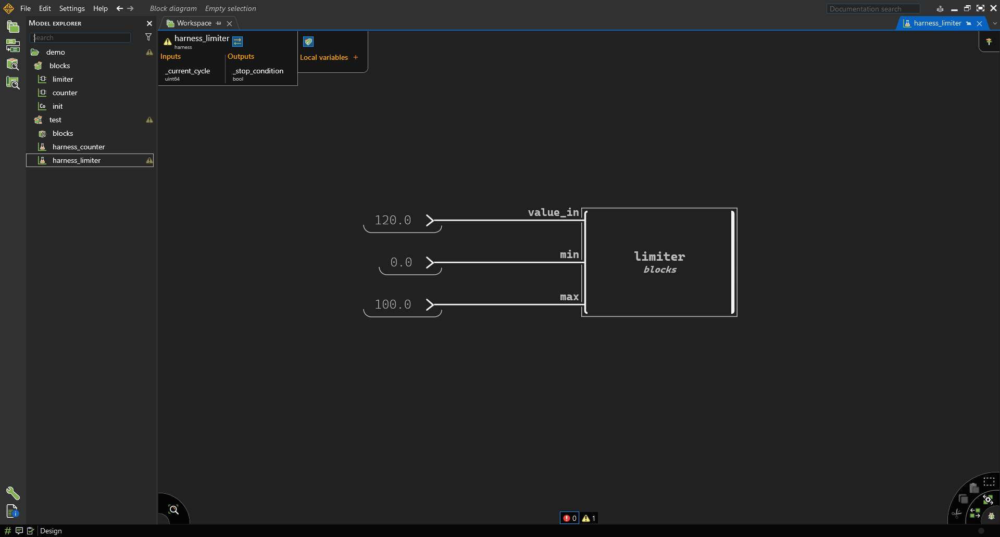
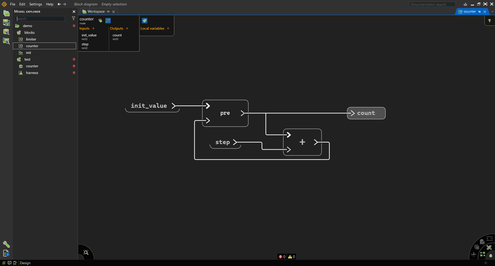
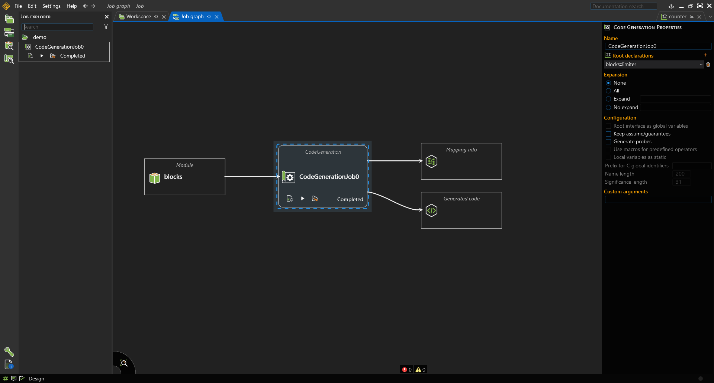
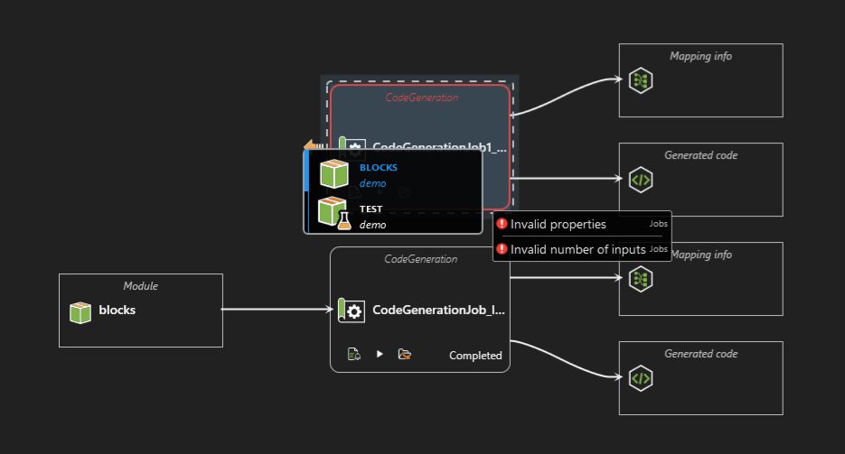
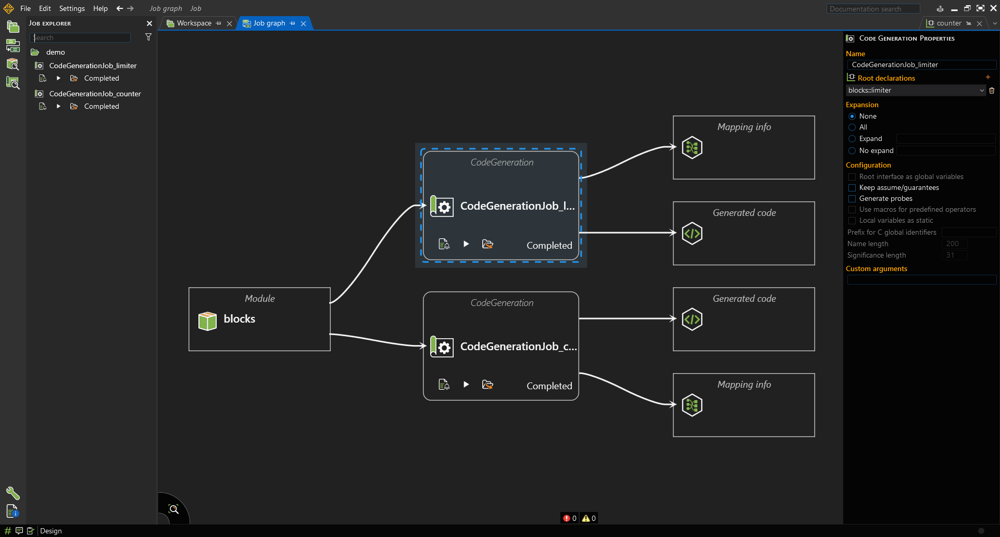
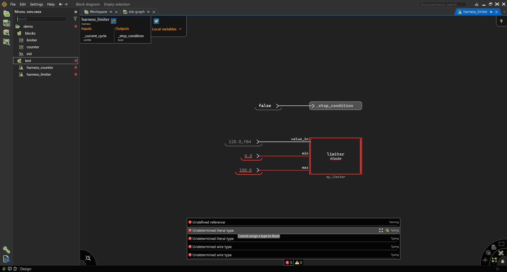

# Lab 3.1 — Introduction to Scade One: Modeling Combinatorial and Sequential Logic

**Course:** Software Engineering  
**Lesson:** Model-Based Design with Scade One  
**Duration:** 2–3 hours  
**Tool:** Ansys Scade One Student Edition  
**Work mode:** Individual

---

# Context

This lab introduces the fundamentals of **Model-Based Design (MBD)** using **Scade One**.

Unlike traditional programming:
- systems are designed graphically
- the model itself is executable
- testing is integrated into the design workflow
- code can later be generated automatically

This lab focuses on two fundamental categories of digital systems:

| Type | Meaning |
|---|---|
| **Combinatorial Logic** | Output depends only on current inputs |
| **Sequential Logic** | Output depends on previous states/history |

**You will implement:**
1. A **Limiter** (combinatorial logic)
2. A **Counter** (sequential logic)
3. A **Test Harness** for each model

---

# Learning Objectives

By the end of this lab you will be able to:

- Create Scade One projects and modules
- Create operators with typed interfaces
- Implement combinatorial logic
- Implement sequential logic using delays (`pre`)
- Simulate models
- Create and configure test harnesses
- Run automated simulations

---

# Prerequisites

### 1 — Install Scade One Student Edition

Download and install the free student version:

**→ [Ansys SCADE Student Free Software Download](https://www.ansys.com/academic/students/ansys-scade-student)**


<!-- <p align="center">
  
</p> -->

> The student edition does not require any registration or license activation — it is ready to use once installed.

### 2 — Complete the QuickStart tutorial

Before starting this lab, watch and follow the official quickstart:

**→ [Scade One Student — Quick Getting Started (YouTube)](https://www.youtube.com/watch?v=ww5-sx8U0lc)**

This covers: creating a project, declaring inputs/outputs, drawing a state machine, and running the simulator. You will need all of these in this lab.

---

## Activity 1B — Create a Swan Module

Inside the project:

```text
New → Swan Module
```

Name it: ```blocks```

This module will contain reusable operators.

---

# Part 2 — Combinatorial Logic: Limiter

---

# Theory

A **combinatorial system** computes outputs only from current inputs.

There is:
- no memory
- no previous state
- no delay

Equivalent software example for a limiter function:

```python
if value > max_value:
    output = max_value
elif value < min_value:
    output = min_value
else:
    output = value
```

This type of logic is frequently used for:
- saturation
- validation
- range checking
- signal conditioning

---

## Activity 2A — Create the Operator in Scade One

Inside `blocks`: ```New → Operator```

Name: ```limiter```

---

## Activity 2B — Define the Interface

Add the following:

| Name | Type | Direction |
|---|---|---|
| `value_in` | `float64` | Input |
| `min` | `float64` | Input |
| `max` | `float64` | Input |
| `value_out` | `float64` | Output |

---


## Activity 2C — Implement the Logic

Implement the following behavior:

```python
if value_in > max_value:
    value_out = max_value
elif value_in < min_value:
    value_out = min_value
else:
    value_out = value_in
```

To implement this in Scade One, use:
- comparison blocks (`>`, `<`)
- conditional/switch blocks
- direct signal connections

Your completed model should resemble:
- upper branch → saturation at maximum
- lower branch → saturation at minimum
- otherwise pass-through

Here is how it should look like:


Next, we'll cover a few things about data types in Scade One:


### Understanding Definition vs Expression


When right-clicking in a Scade diagram, you will frequently use: ```Definition``` and ```Expression```

These are the two most important modeling elements.

| Element | Use it for |
|---|---|
| **Expression** | Computations and values |
| **Definition** | Named outputs/signals |

---

### Use **Expression** when you want:

- constants (defined by value and data type)
- intermediate computations that don't need a name

Examples:

```text
0_i32
0.0_f64
```

Think: ```"A value"```

---

### Instance blocks

Operators like arithmetic, comparisons, and delays are **instance blocks**, not expressions — an instance block instantiates an operator that processes flows.

```text
+
-
>
<
pre
```

Think: ```"Process a flow"```

---

### Use **Definition** when you want:

- an output
- a local variable
- a named signal

Think: ```"Store or expose a result"```

---

## Activity 2D — Simulate the Model


Switch to simulation mode: Start debug session (F5), or clicking on the button in the bottom right corner.


Test the following values:

| value_in | min_value | max_value | Expected value_out |
|---|---|---|---|
| 5 | 0 | 10 | 5 |
| 20 | 0 | 10 | 10 |
| -5 | 0 | 10 | 0 |

If there are any errors or warnings, fix any:
- type mismatches
- unconnected signals
- undefined references

---

# Part 3 — Test Harness for Combinatorial Logic

---

# Theory

A **Test Harness** is a test environment around an operator.

It:
- injects inputs (predefined)
- executes the model
- observes outputs
- automates testing

---

## Activity 3A — Create Test Module

Create a module: ```test```

---

## Activity 3B — Import the Blocks Module

Inside `test`, add: ```use blocks``` (Add actions (+) > Create use directive)

---

## Activity 3C — Create Harness

Create: ```New → Harness```

Name: ```limiter_harness```

---

## Activity 3D — Add Operator Under Test

Drag `limiter` into the harness diagram.

Connect constants:

| Signal | Value_type |
|---|---|
| `value_in` | `120.0_f64` |
| `min_value` | `0.0_f64` |
| `max_value` | `100.0_f64` |




---

Select the operator instance.

Enable: ```Operator under test```


> `_stop_condition` is implicitly `false` by default — you don't need to connect anything to it.

---

## Activity 3E — Run the Harness

Run simulation:
- Start debug session (F5)
- Step (F9)

click on the model to open it: Open (Enter)

Expected output: ```value_out = 100.0```

because:
- input exceeds maximum
- limiter saturates output

---

# Part 4 — Sequential Logic: Counter

---

# Theory

A **sequential system** depends on:
- current inputs
- previous outputs/state

Sequential systems require:
- memory
- delays
- state variables

Scade One uses:
- `pre` — the delay operator
- `->` — the **initial value** operator, giving the value used on the first cycle only

for stateful behavior. Combined as the binary `pre` (e.g. `0 pre x`), this is the **initialized delay**: it outputs the initial value on the first cycle, then the previous value of `x` afterwards.

for stateful behavior.

---

## Activity 4A — Create the Counter Operator

Inside `blocks`: ```New → Operator```

Name: ```counter```

---

## Activity 4B — Define the Interface

Add:

| Name | Type | Direction |
|---|---|---|
| `init_value` | `int32` | Input |
| `step` | `int32` | Input |
| `count` | `int32` | Output |

---

## Activity 4C — Implement Sequential Logic


 


Behavior:

```python
count = previous_count + step
```

Use:
- `pre`
- `+`
- initialized delay

Equivalent Scade equation:

```text
count = init_value -> pre(count) + step
```

or equivalently:

```text
old_count = init_value -> pre(count)
count = old_count + step
```

---

## Activity 4D — Simulate

Use:
- `init_value = 0`
- `step = 1`

Run multiple cycles: Step (F9).

Expected behavior:

| Cycle | Count |
|---|---|
| 0 | 0 |
| 1 | 1 |
| 2 | 2 |
| 3 | 3 |

---

# Part 5 — Test Harness for Sequential Logic

---

## Activity 5A — Create Harness

Create: ```counter_harness```

inside the `test` module.

 

---

## Activity 5B — Add Operator Under Test

Drag and drop the `counter` block into the harness.

Connect:

| Signal | Value |
|---|---|
| `init_value` | `0_i32` |
| `step` | `1_i32` |

Enable: ```Operator under test``` for the counter instance.

> `_stop_condition` is implicitly `false` by default — you don't need to connect anything to it.

---

## Activity 5C — Run Sequential Simulation

Execute multiple cycles.

Observe:
- the counter value increases at each cycle
- the operator now has memory/state

---

# Part 6 — Comparing Combinatorial vs Sequential Logic

---

| Feature | Combinatorial | Sequential |
|---|---|---|
| Depends on current inputs | Yes | Yes |
| Depends on previous state | No | Yes |
| Uses memory | No | Yes |
| Uses `pre` | No | Yes |
| Uses delays | No | Yes |
| Example | Limiter | Counter |

---

# Part 7 — Python Test Script

---

Scade One can generate C code from your model and expose it via a Python wrapper. This lets you test both operators programmatically — reproducing the simulation steps from Parts 2 and 4 as automated, repeatable tests.

**Reference:** [Testing Scade One models with Python](https://innovationspace.ansys.com/knowledge/forums/topic/testing-scade-one-models-with-python/)

---

## Activity 7A — Create and Run a Code Generation Job

Code generation in Scade One is done through a **Job**, not a menu command. You need one job per operator root.

 

**For the `limiter`:**

1. Open the **Job Explorer** panel (left sidebar)
2. Right-click your project → **New Job → Code Generation**
3. Name it e.g. `CodeGenerationJob_limiter`
4. In the **Code Generation Properties** panel (right side), set **Root declarations** to `blocks::limiter`
5. Click **Run** (▶) — the job graph shows the flow: `blocks` module → `CodeGenerationJob` → Generated code
6. Wait for status to show **Completed**

 

 

**For the `counter`:**

Repeat the same steps, setting **Root declarations** to `blocks::counter`.

The generated code appears in the job's output folder (click the **Generated code** node in the job graph to open it). It contains `limiter_blocks.c`, `limiter_blocks.h` (and equivalent for counter) plus supporting files like `swan_types.h`.

> The Python bridge loads this generated C code at runtime — the job must have completed successfully before running any Python tests.

---

## Activity 7B — Generate the Python Wrapper

After the code generation job completes (Activity 7A), use `PythonWrapper` to build a Python-callable DLL from the generated C code.

**Install the required Python package first:**

```text
pip install ansys-scadeone-core==0.8.2
```

Or using a `requirements.txt`:

```text
# requirements.txt
ansys-scadeone-core==0.8.2
```

```text
pip install -r requirements.txt
py -3 -m pip install -r requirements.txt --user
```

Then create `setup_wrapper.py` in your project folder:

```python
# setup_wrapper.py
# Run this once to generate Python-callable wrappers for both operators.

from pathlib import Path
from ansys.scadeone.core import ScadeOne
from ansys.scadeone.core.svc.pywrapper.python_wrapper import PythonWrapper

SCADE_INSTALL = r"C:\Program Files\Ansys Inc\v261\Scade One Student\Scade One"
PROJECT_DIR   = r"path\to\your\demo.sproj"

app = ScadeOne(install_dir=SCADE_INSTALL)
prj = app.load_project(PROJECT_DIR)
prj.load_jobs()

# Each operator gets its own output name so they don't overwrite each other.
# The job name is a string — do NOT pass prj.get_job(...) here.
PythonWrapper(prj, "CodeGenerationJob_limiter", output="limiter_wrapper").generate()
PythonWrapper(prj, "CodeGenerationJob_counter", output="counter_wrapper").generate()

print("Wrappers generated.")
```

Run it once:

```text
python setup_wrapper.py
```

This produces:
- `limiter_wrapper/limiter_wrapper.py` — contains class `limiter_blocks`
- `counter_wrapper/counter_wrapper.py` — contains class `counter_blocks`

> **Class naming:** the generated class name is `<module>_<operator>` — e.g. the `limiter` operator inside the `blocks` module becomes `limiter_blocks`. Open the generated `.py` file to confirm the exact class name before writing tests.

---

## Activity 7C — Limiter Test Harness

Inputs and outputs are **direct attributes** on the generated object. The cycle method is `.cycle()`.

Create `test_limiter.py`:

```python
# test_limiter.py
# Tests the generated limiter operator.
# Mirrors the 3 manual simulation steps from Activity 2D.
# Run setup_wrapper.py first.

import sys
from pathlib import Path

sys.path.insert(0, str(Path(__file__).parent / "limiter_wrapper"))
from limiter_wrapper import limiter_blocks  # class is <module>_<operator>

lim = limiter_blocks()

test_cases = [
    # (value_in, min, max, expected_out)
    ( 5.0,  0.0, 10.0,  5.0),   # pass-through
    (20.0,  0.0, 10.0, 10.0),   # clamp at max
    (-5.0,  0.0, 10.0,  0.0),   # clamp at min
]

print("=" * 55)
print("  LIMITER TEST REPORT")
print("=" * 55)

all_passed = True
for value_in, min_v, max_v, expected in test_cases:
    lim.reset()
    lim.inputs.value_in = value_in  # inputs via .inputs.<name>
    lim.inputs.min      = min_v
    lim.inputs.max      = max_v
    lim.cycle()
    result = lim.outputs.value_out  # outputs via .outputs.<name>
    status = "PASS" if abs(result - expected) < 1e-9 else "FAIL"
    if status == "FAIL":
        all_passed = False
    print(f"  in={value_in:6.1f}  min={min_v:.1f}  max={max_v:.1f}"
          f"  → expected={expected:.1f}  got={result:.1f}  {status}")

print("-" * 55)
print("  ALL PASS" if all_passed else "  SOME TESTS FAILED")
print("=" * 55)
```

---

## Activity 7D — Counter Test Harness

The counter is **sequential** — do not reset between steps. Run four consecutive `.cycle()` calls and observe the accumulating count:

```python
# test_counter.py
# Tests the generated counter operator.
# Mirrors the multi-cycle simulation from Activity 4D.
# Run setup_wrapper.py first.

import sys
from pathlib import Path

sys.path.insert(0, str(Path(__file__).parent / "counter_wrapper"))
from counter_wrapper import counter_blocks  # class is <module>_<operator>

cnt = counter_blocks()

expected_sequence = [0, 1, 2, 3]

print("=" * 40)
print("  COUNTER TEST REPORT")
print("=" * 40)

cnt.reset()  # reset once — do NOT reset between cycles
all_passed = True
for cycle_n, expected in enumerate(expected_sequence):
    cnt.inputs.init_value = 0  # inputs via .inputs.<name>
    cnt.inputs.step       = 1
    cnt.cycle()               # advance one clock cycle
    result = cnt.outputs.count  # outputs via .outputs.<name>
    status = "PASS" if result == expected else "FAIL"
    if status == "FAIL":
        all_passed = False
    print(f"  Cycle {cycle_n}  expected={expected}  got={result}  {status}")

print("-" * 40)
print("  ALL PASS" if all_passed else "  SOME TESTS FAILED")
print("=" * 40)
```

> **Note on the counter:** `reset()` puts the operator back to its initial state (the `->` value). Each `.cycle()` call then advances the internal `pre` register — this is what makes it different from the limiter, which has no memory.

---

## Activity 7E — Run and Evaluate

```text
python test_limiter.py
python test_counter.py
```

> **API note:** The exact class name and instantiation method depend on your Scade One version and project name — check the generated wrapper file. The pattern above follows the `ansys.scadeone.core` API documented at the [reference link](https://innovationspace.ansys.com/knowledge/forums/topic/testing-scade-one-models-with-python/).

---

# Common Errors

---

 


## Undefined Reference

Cause:
- missing:

```swan
use blocks;
```

---

## Missing Operator Under Test

Cause:
- not configured

Fix:
- select operator
- enable: ```Operator under test```

---

## Undetermined Literal Type

Incorrect:

```text
0
```

Correct:

```text
0_i32
0.0_f64
```

---

## Invalid Delay Initialization

Cause:
- incorrect `pre` usage

Correct form:

```text
x = init -> pre(x)
```

---

# Reflection Questions

<style>
  #reflection-quiz { margin-top: 1rem; }
  .quiz-q { margin-bottom: 1.1rem; padding: 1.15rem 1.25rem; background: var(--white); border: 1px solid var(--border); border-radius: 8px; }
  .quiz-q strong { display: block; margin-bottom: .7rem; color: var(--navy); font-size: .97rem; }
  .quiz-option { display: flex; align-items: flex-start; gap: .55rem; padding: .42rem .55rem; border-radius: 5px; cursor: pointer; transition: background .13s; user-select: none; font-size: .92rem; }
  .quiz-option:hover { background: var(--ice); }
  .quiz-option input { margin-top: .22rem; flex-shrink: 0; accent-color: var(--blue); }
  .quiz-option.correct { background: #E8F5E9; color: #1B5E20; font-weight: 600; border-radius: 5px; }
  .quiz-option.wrong   { background: #FFEBEE; color: #B71C1C; text-decoration: line-through; border-radius: 5px; }
  .quiz-option.reveal  { background: #FFF8E1; color: #BF360C; font-weight: 600; border-radius: 5px; }
  #quiz-submit { margin-top: .75rem; padding: .55rem 1.5rem; background: var(--blue); color: var(--white); border: none; border-radius: 6px; font-size: .9rem; font-weight: 600; cursor: pointer; transition: background .15s; }
  #quiz-submit:hover:not(:disabled) { background: var(--sky); }
  #quiz-submit:disabled { opacity: .45; cursor: default; }
  #quiz-score { display: inline-block; margin-left: 1rem; font-size: 1rem; font-weight: 700; vertical-align: middle; }
  #quiz-reset { display: none; margin-left: .75rem; padding: .55rem 1.1rem; background: transparent; color: var(--muted); border: 1px solid var(--border); border-radius: 6px; font-size: .88rem; cursor: pointer; transition: color .15s, border-color .15s; vertical-align: middle; }
  #quiz-reset:hover { color: var(--blue); border-color: var(--sky); }
</style>

<div id="reflection-quiz">
  <div class="quiz-q" data-correct="b">
    <strong>1. What is the difference between combinatorial and sequential logic?</strong>
    <label class="quiz-option"><input type="radio" name="q1" value="a"><span>Combinatorial logic uses clocks; sequential logic does not</span></label>
    <label class="quiz-option"><input type="radio" name="q1" value="b"><span>Combinatorial output depends only on current inputs; sequential output also depends on past state</span></label>
    <label class="quiz-option"><input type="radio" name="q1" value="c"><span>Combinatorial logic is slower; sequential logic is faster</span></label>
    <label class="quiz-option"><input type="radio" name="q1" value="d"><span>There is no difference — both require memory elements</span></label>
  </div>
  <div class="quiz-q" data-correct="c">
    <strong>2. Why does sequential logic require memory?</strong>
    <label class="quiz-option"><input type="radio" name="q2" value="a"><span>To store the program binary</span></label>
    <label class="quiz-option"><input type="radio" name="q2" value="b"><span>To buffer network packets between cycles</span></label>
    <label class="quiz-option"><input type="radio" name="q2" value="c"><span>To retain state between clock cycles so past inputs can influence future outputs</span></label>
    <label class="quiz-option"><input type="radio" name="q2" value="d"><span>Because the hardware mandates it regardless of the design</span></label>
  </div>
  <div class="quiz-q" data-correct="d">
    <strong>3. Why does Scade require explicit signal types?</strong>
    <label class="quiz-option"><input type="radio" name="q3" value="a"><span>To reduce compile time</span></label>
    <label class="quiz-option"><input type="radio" name="q3" value="b"><span>To enable automatic memory allocation at runtime</span></label>
    <label class="quiz-option"><input type="radio" name="q3" value="c"><span>To allow the IDE to colorize wires</span></label>
    <label class="quiz-option"><input type="radio" name="q3" value="d"><span>To enable formal verification and guarantee type-safe, unambiguous data flow in safety-critical models</span></label>
  </div>
  <div class="quiz-q" data-correct="b">
    <strong>4. What advantages do test harnesses provide?</strong>
    <label class="quiz-option"><input type="radio" name="q4" value="a"><span>They replace the need for formal proofs entirely</span></label>
    <label class="quiz-option"><input type="radio" name="q4" value="b"><span>They automate input injection and output verification, enabling repeatable regression testing without manual simulation</span></label>
    <label class="quiz-option"><input type="radio" name="q4" value="c"><span>They speed up code generation by skipping unused nodes</span></label>
    <label class="quiz-option"><input type="radio" name="q4" value="d"><span>They are only useful for hardware-in-the-loop testing</span></label>
  </div>
  <div class="quiz-q" data-correct="c">
    <strong>5. Why is model-based design useful in safety-critical systems?</strong>
    <label class="quiz-option"><input type="radio" name="q5" value="a"><span>It eliminates all runtime bugs automatically</span></label>
    <label class="quiz-option"><input type="radio" name="q5" value="b"><span>It allows developers to skip documentation requirements</span></label>
    <label class="quiz-option"><input type="radio" name="q5" value="c"><span>Executable graphical models serve as both specification and implementation, enabling early validation and traceability to requirements</span></label>
    <label class="quiz-option"><input type="radio" name="q5" value="d"><span>It is faster to compile than hand-written C code</span></label>
  </div>
  <div>
    <button id="quiz-submit" type="button">Check Answers</button>
    <button id="quiz-reset" type="button">Try Again</button>
    <span id="quiz-score"></span>
  </div>
</div>

---

# Key Takeaway

In Scade One:
- graphical models are executable
- combinatorial systems react instantly
- sequential systems maintain state
- testing is integrated into the workflow
- harnesses automate verification

These concepts form the foundation of Model-Based Design (MBD).