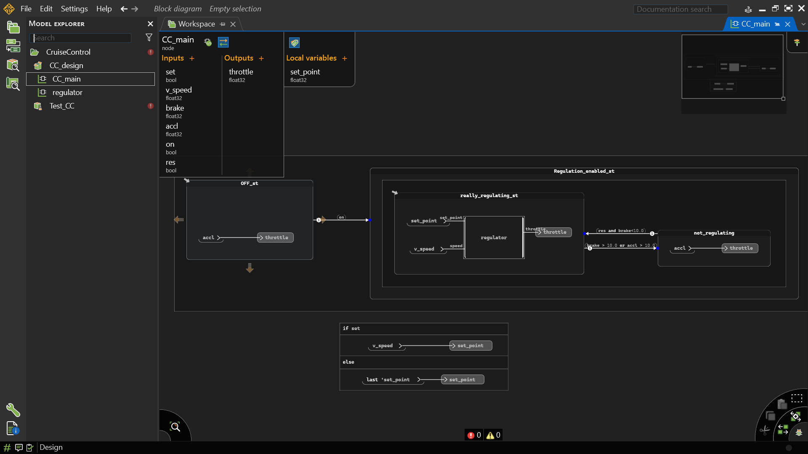
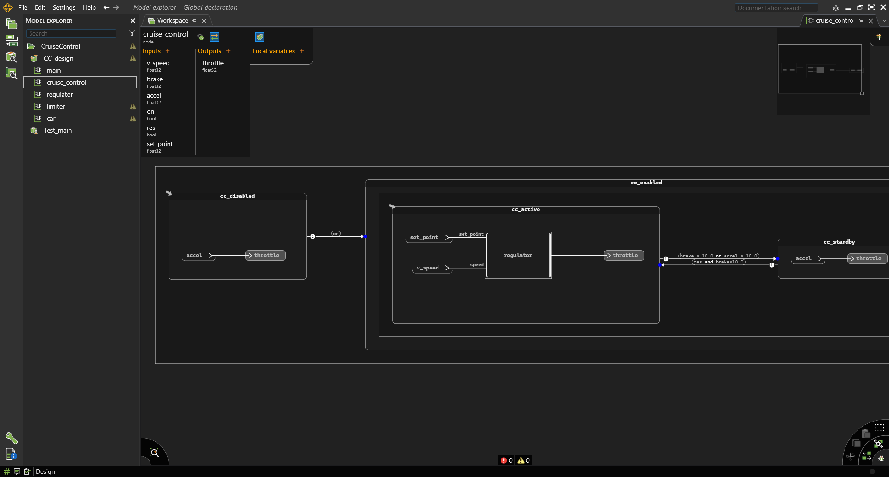
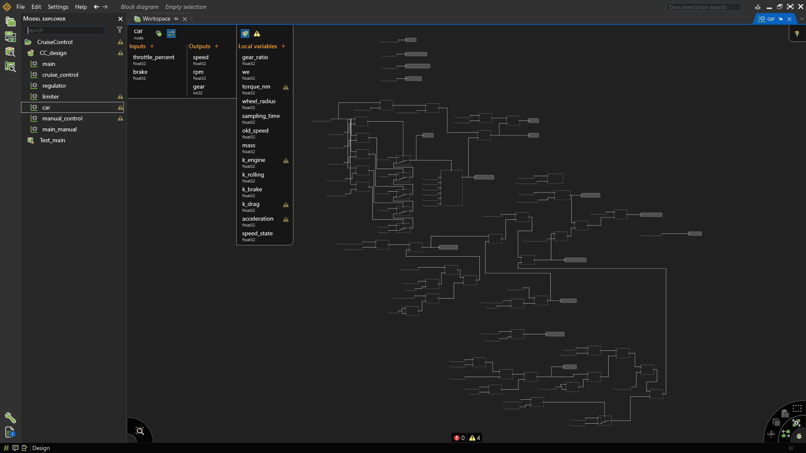
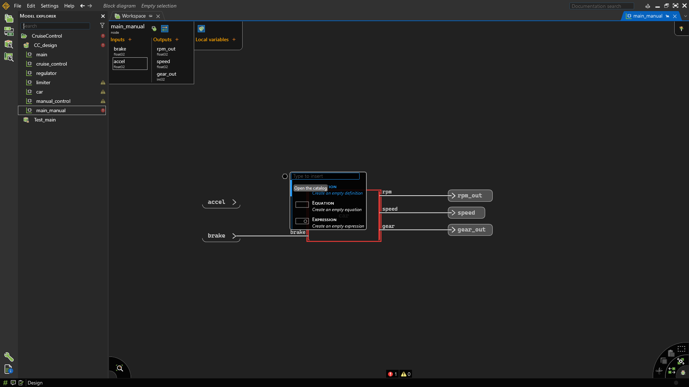
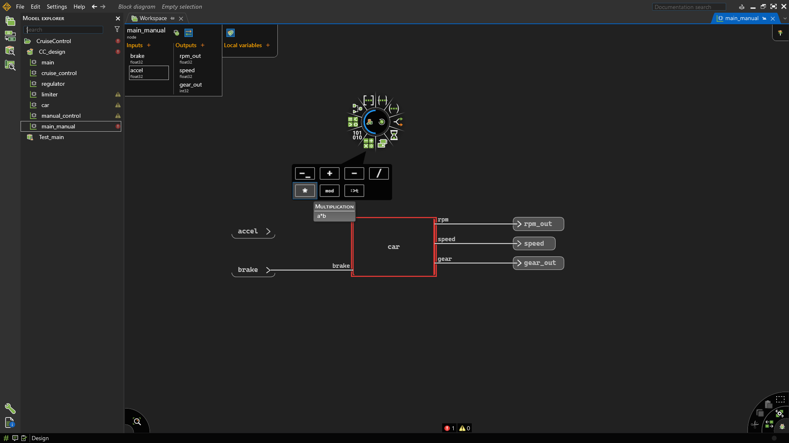
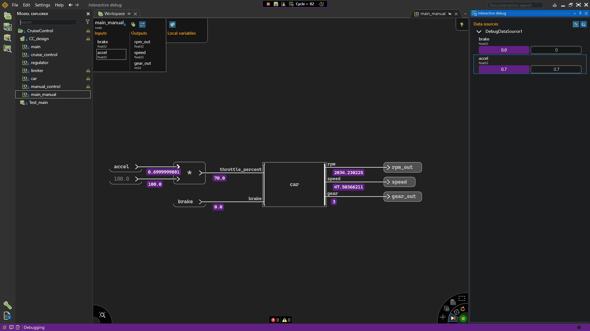
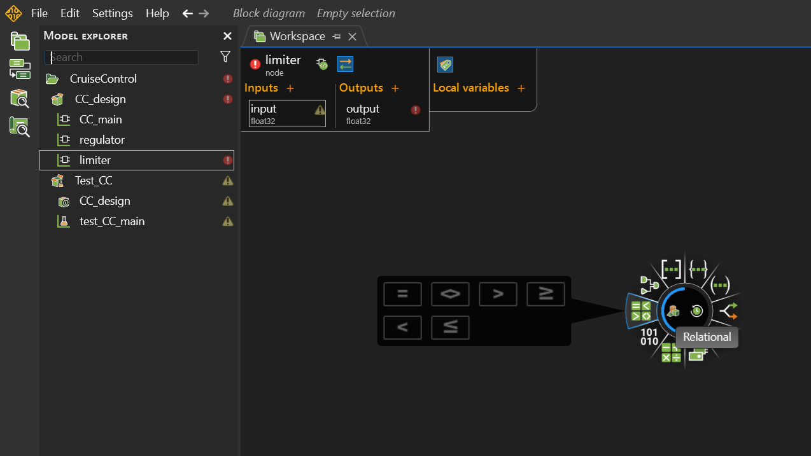
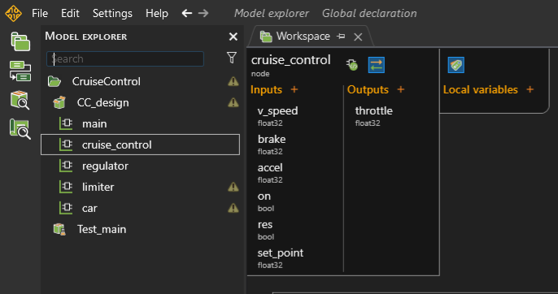
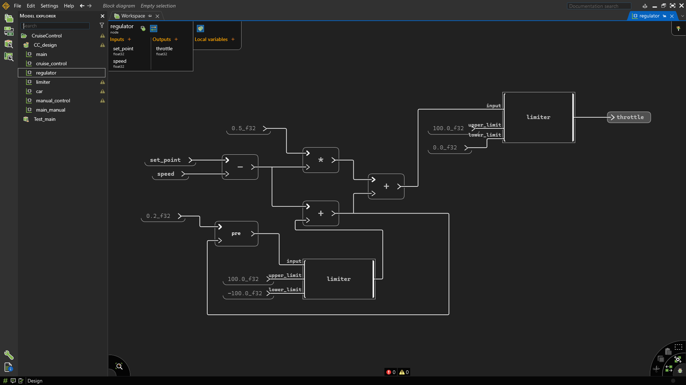

# Lab 3.2 — Implementing a Cruise Control System with Scade One

**Course:** Software Engineering &nbsp;·&nbsp; **Lesson:** Model-Based Design with Scade One  
**Duration:** 2–3 hours &nbsp;·&nbsp; **Tool:** Ansys Scade One (Student Edition) &nbsp;·&nbsp; **Work mode:** Individual  
**Prerequisites:** [Lab 2 — Applying the SDLC (Python)](../lab2/) &nbsp;·&nbsp; [Lab 3.1 — Introduction to Scade One](../lab3_1/)

---

## Context

In Lab 2 you implemented the cruise control safety logic in Python, working through all SDLC phases manually — requirements, decision table, implementation, V&V, and traceability.

In this lab you implement the **same system** in **Scade One** — the industrial model-based design tool used in aerospace, automotive, and railway. You will see how every phase you did by hand in Python maps directly to a Scade One feature:

| What you did manually in Lab 2 | What Scade One provides |
|-------------------------------|------------------------|
| Decision table on paper | Graphical state machine editor |
| Python function with comments | Operator with typed interface |
| `run_tests()` by hand | Simulation and Python test scripts |
| Traceability matrix as comments | Built-in requirement tracing |
| `pass` → implement | Code generation (certified C) |

> **Lab 3 connection:** Lab 3 introduced Scade One from scratch — combinatorial vs sequential logic, typed operator declarations, the simulator, and Python test scripts. This lab applies those same skills to a realistic safety-critical system. Refer back to [Lab 3](../lab3/) if any tool concept is unfamiliar.

---

## Prerequisites

### 1 — Install Scade One Student Edition

Download and install the free student version:

**→ [Ansys SCADE Student Free Software Download](https://www.ansys.com/academic/students/ansys-scade-student)**


<!-- <p align="center">
  
</p> -->

> The student edition does not require any registration or license activation — it is ready to use once installed.

### 2 — Complete Lab 3 first

Lab 3 covers everything you need to use Scade One in this lab: creating a project, declaring typed inputs/outputs, drawing block diagrams, running the simulator, and building Python test scripts. Work through it before starting here.

**→ [Lab 3 — Introduction to Scade One](../lab3/)**

If you have not done Lab 3 yet, start with the official quickstart instead:

**→ [Scade One Student — Quick Getting Started (YouTube)](https://www.youtube.com/watch?v=ww5-sx8U0lc)**

---

## Objectives

By the end of this lab you will be able to:

- Create a Scade One project with a correctly typed operator interface
- Model the cruise control decision table as a graphical state machine
- Run the built-in Scade One simulator to verify behaviour
- Write a Python test script that calls the generated C code to reproduce the 7 test cases from Lab 2
- Explain how model-based design replaces the manual traceability you maintained in Lab 2

---

## Structure

| Part | Topic | Time |
|------|-------|------|
| 1 | Scade One orientation | 15 min |
| 2 | Car model simulation (plant exploration) | 20 min |
| 3 | Project setup & operator interface | 20 min |
| 4 | State machine design | 30 min |
| 5 | Simulation & manual verification | 20 min |
| 6 | Python test script | 30 min |
| 7 | Traceability & reflection | 15 min |

---

## The System (recap from Lab 2)

You are modelling the `cruise_control` operator — the top-level cruise control node visible in Scade One. The system has **three states** (`OFF`, `SUSPENDED`, `ACTIVE`) and the following interface:


<!--  -->

<!-- <p align="center">
  
</p> -->

 <!--  -->


**Inputs:**

| Name | Type | Description |
|------|------|-------------|
| `set` | `bool` | Driver presses activate |
| `v_speed` | `float32` | Current vehicle speed (km/h) |
| `brake` | `float32` | Brake pedal (0.0 – 1.0) |
| `accel` | `float32` | Accelerator pedal (0.0 – 1.0) |
| `on` | `bool` | CC system on/off |
| `res` | `bool` | Driver explicitly reactivates after SUSPENDED |

**Output:**

| Name | Type | Description |
|------|------|-------------|
| `throttle` | `float32` | Throttle command to engine (0.0 – 1.0) |

> **Note:** This interface matches the `cruise_control` node shown in the Scade One screenshot. The full system also contains a `regulator` suboperator (PI controller) — you will stub that in Part 4 and optionally implement it in Part 7.


---

## Part 1 — Scade One Orientation

> **If you completed Lab 3**, you already know this environment. Confirm you can locate the four elements below, then go straight to Part 3.

- **Model Explorer** (left panel) — project tree: packages, operators, types
- **Workspace / Block Diagram** (centre) — graphical design canvas
- **Inputs / Outputs / Local Variables** panel — operator interface declarations
- **Design / Simulation** toggle (bottom toolbar) — switch between edit and run mode

> If any of these are unfamiliar, revisit **[Lab 3 — Part 0](../lab3/#part-0--scade-one-orientation)** before continuing. The concepts you practised there (typed operators, block diagrams, simulation, test harnesses) are used directly in Parts 3–6 below.

---

## Part 2 — Car Model Simulation

Before building the cruise controller, you will simulate the **car plant model** that is already included in the project. Understanding how the car responds to throttle is essential context for everything that follows: it tells you what the `regulator` needs to do and why the `set_point` and PI constants matter.

The `car` operator is a discrete-time model of vehicle longitudinal dynamics. It takes `throttle` as input and outputs `v_speed` — the same signal your cruise controller will monitor. Simulating it in isolation first lets you answer questions like: *how much throttle holds 80 km/h? how quickly does the car accelerate?*

### Activity 2-1 — Inspect the car operator

1. In the **Model Explorer**, expand the project tree and double-click the `car` operator to open it in the workspace



2. Identify its interface:

   | Port | Direction | Type | Range | Meaning |
   |------|-----------|------|-------|---------|
   | `throttle_percent` | input | `float32` | 0 – 100 | Throttle as a percentage of maximum |
   | `brake` | input | `float32` | 0 – 1 | Brake pedal position |
   | `speed` | output | `float32` | - | Resulting vehicle speed (km/h) |
   | `rpm` | output | `float32` | ≥ 0 | Engine speed (RPM) |
   | `gear` | output | `int32` | ≥ 0 | Current gear |


3. Look at the block diagram inside — you will see the physics approximation: speed change per cycle depends on the throttle force minus aerodynamic drag. Find the `pre` operator — this is the memory element that carries speed from one cycle to the next (same concept as the `Counter` in Lab 3)

### Activity 2-2 — Wire the car operator to a simulation context

To simulate `car` interactively you need a top-level node that instantiates it. Open the `main_manual` node — it already has an `accel` input and a `car` instance, but the pedal signal (0–1) must be scaled to the `throttle_percent` input (0–100) before wiring.

   > Note the range: `throttle_percent` is 0–100, **not** 0–1. The accelerator pedal in your model is 0–1, so you will need to scale it before connecting.

**Add the scale block:**



1. In the **Model Explorer**, open `main_manual`
2. Right-click the canvas → **Add Block → Arithmetic → Multiply** to insert a `*` block
3. Connect the `accel` input signal (0.0 – 1.0) to the **first** input port of the multiplier
4. Right-click the **second** input port of the multiplier → **Add Constant** → enter `100.0`

   > This converts the normalised pedal value to a throttle percentage: pedal `0.5` → `throttle_percent = 50`.

5. Connect the multiplier's output to `car.throttle_percent`
6. Connect `car.v_speed` to the `v_speed` output port of `main_manual`

The diagram should now look like:

```
accel ──┐
        ✕ ── [× 100.0] ──→ car.throttle_percent
100.0 ──┘

```




7. Run **Design → Generate** (F7) — confirm 0 errors before continuing

### Activity 2-3 — Step through the simulation manually

1. With `main_manual` open, switch to **Simulation** mode (bottom toolbar)
2. Set `accel = 0.0`, press **Step** several times — confirm `v_speed` stays at `0.0` (no force, no movement)





3. Work through the scenarios below, pressing **Step** after each input change and recording the `v_speed` output. The multiplier block converts your `accel` input to `throttle_percent` automatically:

   | Steps | `accel` input | Effective `throttle_percent` | Observation to record |
   |-------|---------------|------------------------------|-----------------------|
   | 1–5   | `0.0` | 0   | At rest — speed must stay 0 |
   | 6–15  | `0.5` | 50  | Speed climbs — count cycles to reach ~40 km/h |
   | 16–30 | `1.0` | 100 | Full throttle — record the max speed approached |
   | 31–40 | `0.0` | 0   | Throttle off — observe coasting/deceleration |
   | 41–60 | adjust | adjust × 100 | Find the `accel` value that keeps `v_speed` *steady* near 80 km/h |

4. Record the `accel` value that produces a steady 80 km/h — this is the operating point the PI regulator will work around. A `accel` of ~0.3–0.4 is typical, meaning `throttle_percent` ≈ 30–40

> **Why this matters:** The cruise controller you build in Parts 3–5 will feed its `throttle` output into this same `car` model. Knowing the plant's behaviour now means you can reason about your controller's correctness — if the regulator outputs `0.8` throttle at 80 km/h, you know from this exercise whether that is physically plausible.

---

## Part 3 — Project Setup & Operator Interface

### Activity 3A — Create the project

1. Open Scade One → **File → New Project**
2. Name the project `CruiseControl`
3. Inside the project, create a **package** named `CC_design`
4. Inside `CC_design`, create a **node** (operator) named `cruise_control`

<!-- > **Naming rule (SDR 1–3 from the training document):** names should match the SRS, each word starts with uppercase, separators only used with ALL\_CAPS constants. -->

### Activity 3B — Declare the interface

 <!--  -->

  


In the `cruise_control` operator, declare the inputs and output from the table above. Use `bool` and `float32` as types.

Your interface panel should look like this when complete:

```
Inputs:   set (bool)  |  v_speed (float32)  |  brake (float32)
          accel (float32)  |  on (bool)  |  res (bool)

Outputs:  throttle (float32)
```

> **Question (write in your lab notes):** Compare this interface to `update_cruise_control()` in Lab 2. Which inputs correspond to `driver_activates`, `driver_reactivates`, and `brake_pressed`? What is new?

### Activity 3C — Add a local state variable

Add a **local variable** `set_point` of type `float32` to store the target cruise speed. This will be updated when the driver sets a new speed.

---

## Part 4 — State Machine Design

### Activity 4A — Create the state machine

In the `cruise_control` body, insert a **State Machine** block. Create the four states matching the model:


| State | Level | Meaning |
|-------|-------|---------|
| `cc_disabled` | top-level | System off — throttle follows `accel` directly |
| `cc_enabled` | top-level, composite | Outer state: CC is on. Contains the two inner states below. |
| `cc_active` | inner (inside `cc_enabled`) | CC actively regulating — `regulator` block drives `throttle` |
| `cc_standby` | inner (inside `cc_enabled`) | CC suspended — waiting for explicit `res` to reactivate |

> `cc_enabled` is a **composite state**. When the system enters it, Scade One automatically enters the initial inner state `cc_active`. Brake/accel events move between `cc_active` and `cc_standby` *without* leaving `cc_enabled`. The system only returns to `cc_disabled` when `on` goes false.

### Activity 4B — Draw the transitions

Add transitions following your decision table from Lab 2. Map each row to a transition guard:

| From | Guard condition | To | REQ |
|------|-----------------|----|-----|
| `cc_disabled` | `on` | `cc_enabled` (enters `cc_active`) | REQ-01 |
| `cc_active` | `brake > 10.0 or accel > 10.0` | `cc_standby` | REQ-02, REQ-04 |
| `cc_standby` | `res and brake < 10.0` | `cc_active` | REQ-04 |
| `cc_enabled` | `not on` | `cc_disabled` | REQ-01 |

> **⚠️ Key rule:** The `cc_standby` → `cc_active` transition requires **both** `res = true` and `brake < 10.0`. `res` signals explicit driver intent to reactivate — the system will not resume on its own. This is the same trap as TC-05 in Lab 2: omitting the `res` guard causes the car to resume CC unexpectedly.

### Activity 4C — Add state actions

In each state, set the `throttle` output:

- `cc_disabled`: `throttle = accel` (driver controls throttle directly)
- `cc_active`: `throttle` = output of the `regulator` suboperator (fed `set_point` and `v_speed`)
- `cc_standby`: `throttle = accel` (same as disabled — accelerator takes over while suspended)

> Start with a **stub** for the `regulator`: connect a constant `0.5` to `throttle` inside `cc_active`. This lets you complete and simulate the state machine in Part 5 before tackling the controller maths. Replace the stub with the real operator in Activity 4D below.

### Activity 4D — Implement the `regulator` operator

The `regulator` is a **Proportional-Integral (PI) controller**. It computes the throttle needed to keep `v_speed` at `set_point` by combining two correction terms:

| Term | What it does |
|------|-------------|
| **P** (proportional) | Reacts to the *current* error — big gap → big correction |
| **I** (integral) | Reacts to *accumulated* past error — eliminates steady-state offset that P alone cannot fix |

**Mathematical formulation:**

```
ε(k)     = set_point − v_speed          -- error this cycle

P(k)     = Kp * ε(k)                   -- proportional term

I(k)     = I(k−1) + ε(k) * Ts      -- integral accumulator (uses pre)
           (only if throttle was NOT saturated at k−1, see anti-windup below)

raw(k)   = P(k) + Ki * I(k)            -- combined output

throttle = clamp(raw, 0.0, 1.0)        -- saturate to valid range

We shall use the following constants:
  Kp     = 0.08    (proportional gain)
  Ki     = 0.005   (integral gain)
  Ts = 0.20 s  (sampling period — one simulation cycle)
```

> The PI constants are determined by various methods (experimental, mathematical) to optimize the plant response (in our case the car model). The sampling period is determined according to the dynamic characteristics.


**Create the `regulator` operator in Scade One:**



1. In the **Model Explorer**, right-click `CC_design` → **New Node** → name it `regulator`
2. Declare its interface:

   | Port | Direction | Type |
   |------|-----------|------|
   | `set_point` | input | `float32` |
   | `speed` | input | `float32` |
   | `throttle` | output | `float32` |

3. **Error block** — add a **Subtract** block: `error = set_point − speed`

4. **Proportional term** — add a **Multiply** block and a constant `0.08`: `p_term = 0.08 * error`

5. **Integral accumulator** — this is the sequential part (uses `pre`, just like `Counter` in Lab 3):
   - Add an **Add** block: `i_acc = pre(i_acc) + error * 0.20`
   - The `pre(i_acc)` carries the accumulated error from the previous cycle
   - Set the initial value of `pre(i_acc)` to `0.0`

6. **Anti-windup** — when `throttle` is already saturated (at 0.0 or 1.0), continuing to accumulate error makes the integral grow unboundedly (*windup*), causing overshoot. Disable accumulation when saturated:

   ```
   saturated = (pre(raw) >= 1.0) or (pre(raw) <= 0.0)
   i_acc = if saturated
           then pre(i_acc)          -- hold: don't accumulate while clamped
           else pre(i_acc) + error * 0.20
   ```

   > In Scade One, implement this with an **if/else** block feeding into the accumulator loop.

7. **Combine and clamp** — add blocks for:
   - `raw = p_term + 0.005 * i_acc`
   - `throttle = max(0.0, min(1.0, raw))` — use **Min** and **Max** blocks, or an **if/else** chain

8. **Instantiate inside `cc_active`** — go back to `cruise_control`, enter `cc_active`, delete the stub constant, and drag a `regulator` instance from the Model Explorer. Wire:
   - `set_point` → `regulator.set_point`
   - `v_speed` → `regulator.speed`
   - `regulator.throttle` → `throttle` output

> **Lab 3 connection:** The `pre(i_acc)` loop in step 5 is the same pattern as the `Counter` operator from Lab 3 — a feedback wire through `pre` creates the sequential memory. The only difference is that here the feedback is inside a sub-operator rather than the top-level node.

### Activity 4E — Handle `set_point`

`set_point` is a **local variable** (not an input). It captures the current vehicle speed at the moment `on` first goes true, then holds that value:

```
set_point = if (on and not pre(on))
            then v_speed          -- rising edge of 'on': lock in current speed
            else pre(set_point)   -- all other cycles: hold previous value
```

> `pre` returns the value from the previous clock cycle — the sequential memory concept from Lab 3. This is the graphical equivalent of `self.set_point` in the Python implementation from Lab 2.

---

## Part 5 — Simulation & Manual Verification

Scade One has two complementary ways to verify a model: the interactive **Simulator** (drive inputs by hand, watch outputs and state highlights in real time) and **Test Harnesses** (automate sequences of inputs and expected outputs). You will use both in this part.

### Activity 5A — Build and validate the model

Before simulating, Scade One must compile the model and report any structural errors.

1. Click **Design → Generate** (or press **F7**) to trigger the build
2. Watch the **Output** panel at the bottom — look for:
   - Type mismatches (e.g. connecting a `float32` wire to a `bool` port)
   - Unconnected output ports (every output of every operator must be wired)
   - Missing initial value on variables that use `pre` (Scade One requires an explicit initialiser)
3. Fix any errors reported before continuing — the simulator will not launch on a model with build errors
4. A successful build shows **0 errors** in the output panel; warnings about unused variables can be ignored for now

> **What you get for free:** In Lab 2 you had to run your Python code before discovering type errors. Scade One's type checker catches these at build time — before any execution. Note down any errors it catches for Activity 3D.

### Activity 5B — Launch the simulator and set initial values


1. Click the **Simulation** toggle in the bottom toolbar (or press **Ctrl+F5**) to switch from Design mode to Simulation mode
2. The workspace highlights the currently active state — confirm `cc_disabled` is highlighted (it is the initial state)
3. In the **Inputs** panel on the left, set the starting values:

   | Input | Initial value | Reason |
   |-------|--------------|--------|
   | `on` | `false` | CC off at start |
   | `brake` | `0.0` | No braking |
   | `accel` | `0.5` | Driver holding accelerator at 50% |
   | `v_speed` | `0.0` | Vehicle not yet moving |
   | `res` | `false` | No reactivation request |

4. Press **Step** (▶|) once to execute the first clock cycle
5. Confirm: `throttle` output equals `accel` (`0.5`) — in `cc_disabled` the accelerator passes through directly

### Activity 5C — Trace the state hierarchy by hand

Before running full scenarios, spend 5 minutes stepping through the state machine to build intuition about the composite structure:

1. With `on = false` — confirm you are in `cc_disabled`. `throttle` mirrors `accel`.
2. Set `on = true`, press **Step** — the system enters `cc_enabled` and immediately drops into `cc_active` (the initial inner state). Both `cc_enabled` and `cc_active` should highlight simultaneously in the workspace.
3. Observe `throttle` — it is now driven by the `regulator` block. With `v_speed = 0` and `set_point = 0` the output will be near zero; that is expected.
4. Set `v_speed = 80.0`, press **Step** — the regulator now has a non-zero speed signal. Note the `throttle` value.
5. Set `brake = 15.0`, press **Step** — the guard `brake > 10.0` fires. The active state moves from `cc_active` to `cc_standby`, *still inside `cc_enabled`*. `throttle` now equals `accel`.
6. Set `brake = 0.0`, `res = false`, press **Step** — the system stays in `cc_standby` (the reactivation guard `res and brake < 10.0` requires `res = true`).
7. Set `res = true`, press **Step** — the system returns to `cc_active`. `throttle` returns to regulator output.
8. Set `on = false`, press **Step** — the system exits `cc_enabled` entirely and returns to `cc_disabled`.

> **Key observation:** Steps 5–6 are the graphical equivalent of TC-05 from Lab 2. In Python you had to read the code carefully to find the bug. Here, the *active state highlight* in the workspace makes the problem immediately visible.

---

## Part 6 — Python Test Script

Scade One can generate C code from your model and expose it via a Python wrapper. This lets you reproduce the exact test suite from Lab 2 automatically.

> **Lab 3 connection:** In Lab 3 you built Python test scripts for the `Counter` and `Limiter` operators using this exact API — the same `PythonWrapper`, the same `.cycle()` method, the same attribute-based input/output access. The only difference here is that `cruise_control` is stateful (state machine), so the *sequence* of `run_step()` calls matters for multi-cycle scenarios. Refer to Lab 3 Part 4 if the wrapper setup is unfamiliar.

**Reference:** [Testing Scade One models with Python](https://innovationspace.ansys.com/knowledge/forums/topic/testing-scade-one-models-with-python/)

### Activity 6A — Create and Run a Code Generation Job

Code generation in Scade One is job-based, not a menu command.

1. Open the **Job Explorer** panel (left sidebar)
2. Right-click your project → **New Job → Code Generation**
3. Name it e.g. `CodeGenerationJob_CC`
4. In the **Code Generation Properties** panel, set **Root declarations** to your `cruise_control` operator
5. Click **Run** (▶) and wait for status **Completed**

The generated code appears in the job's output folder (click the **Generated code** node in the job graph).

### Activity 6B — Generate the Python Wrapper

After the code generation job completes, use `PythonWrapper` to build a Python-callable DLL from the generated C code.

**Install the required Python package first:**

```text
pip install ansys-scadeone-core==0.8.2
```

Or with a `requirements.txt`:

```text
# requirements.txt
ansys-scadeone-core==0.8.2
```

```text
pip install -r requirements.txt
```

Then create `setup_wrapper.py` in your project folder and run it once:

```python
# setup_wrapper.py — run once to produce the Python wrapper

from ansys.scadeone.core import ScadeOne
from ansys.scadeone.core.svc.pywrapper.python_wrapper import PythonWrapper

SCADE_INSTALL = r"C:\Program Files\ANSYS Inc\v251\SCADE"  # adjust to your install
PROJECT_DIR   = r"path\to\your\CruiseControl.sproj"       # path to your .sproj file

app = ScadeOne(install_dir=SCADE_INSTALL)
prj = app.load_project(PROJECT_DIR)
prj.load_jobs()

# PythonWrapper takes the job name as a string, not a job object
PythonWrapper(prj, "CodeGenerationJob_CC").generate()

print("Wrapper generated.")
```

```text
py -3.12 setup_wrapper.py
```

This produces a class for `cruise_control`. The class name follows the pattern `<operator>_<wrapper>` — check the generated file to confirm the exact name before writing the tests.

### Activity 6C — Python Test Script

Inputs and outputs are **direct attributes** on the generated object. The cycle method is `.cycle()`.

Create `test_cc_main.py`:

```python
# test_cc_main.py
# Tests the generated cruise_control operator via the Scade One Python wrapper.
# Mirrors the test cases from Lab 2.

from ansys.scadeone.core import ScadeOne
from ansys.scadeone.core.svc.pywrapper.python_wrapper import PythonWrapper

SCADE_INSTALL = r"C:\Program Files\ANSYS Inc\v251\SCADE"
PROJECT_DIR   = r"path\to\your\CruiseControl.sproj"

app = ScadeOne(install_dir=SCADE_INSTALL)
prj = app.load_project(PROJECT_DIR)
prj.load_jobs()
job = prj.get_job("CodeGenerationJob_CC")
gen = PythonWrapper(prj, job)
gen.generate()

# Instantiate generated operator class — check generated file for exact name.
cc = gen.get_operator_instance()

def run_step(on, set_spd, brake, accel, res, v_speed):
    """Set inputs, run one cycle, return throttle output."""
    cc.on      = on       # inputs are direct attributes
    cc.set     = set_spd
    cc.brake   = brake
    cc.accel   = accel
    cc.res     = res
    cc.v_speed = v_speed
    cc.cycle()            # advance one clock cycle
    return cc.throttle    # output is a direct attribute

def reset():
    cc.reset()
    run_step(False, False, 0.0, 0.0, False, 0.0)  # one idle cycle after reset

print("=" * 60)
print("  VERIFICATION REPORT -- cruise_control (Scade One)")
print("=" * 60)

test_cases = [
    # (on,   set,   brake,  accel,  res,   v_speed, description,              req)
    (True,  False,  0.0,   0.5,  False,  80.0, "CC active, no brake",    "REQ-01"),
    (True,  False,  15.0,  0.5,  False,  80.0, "Brake -> not_regulating","REQ-02,REQ-04"),
    (True,  True,   0.0,   0.5,  False,  80.0, "Set only, no res",       "REQ-04 ***"),
    (True,  False,  0.0,   0.5,  True,   80.0, "Res -> regulating again","REQ-04"),
    (False, False,  0.0,   0.5,  False,  80.0, "CC off -> OFF_st",       "REQ-01"),
]

for on, set_spd, brake, accel, res, v_speed, desc, req in test_cases:
    reset()
    if on:
        run_step(True, False, 0.0, 0.0, False, v_speed)  # turn on first
    throttle = run_step(on, set_spd, brake, accel, res, v_speed)
    print(f"  [{req:18s}] {desc:35s} | throttle={throttle:.3f}")

print("=" * 60)
print("Compare S-03 (set only from not_regulating) — throttle must not increase.")
```

> **API note:** The exact class name and instantiation method depend on your Scade One version — check the generated wrapper file. The pattern above follows the `ansys.scadeone.core` API from the [reference documentation](https://innovationspace.ansys.com/knowledge/forums/topic/testing-scade-one-models-with-python/).

### Activity 6D — Run and Compare

Run:

```text
python test_cc_main.py
```

Compare the output to Lab 2's verification report. Write 2–3 sentences: what is the same, and what is different about testing via generated C vs. testing your Python implementation directly?

---

## Part 7 — Traceability & Reflection

### Activity 7A — Traceability in Scade One

In Lab 2 you maintained a traceability matrix as a Python comment. In Scade One, open the **Requirements** panel and link the following model elements to their REQ IDs:

| Model element | REQ |
|---------------|-----|
| Transition `cc_disabled` → `cc_enabled` (guard: `on`) | REQ-01 |
| Transition `cc_enabled` → `cc_disabled` (guard: `not on`) | REQ-01 |
| Transition `cc_active` → `cc_standby` (guard: `brake > 10.0 or accel > 10.0`) | REQ-02, REQ-04 |
| Transition `cc_standby` → `cc_active` (guard: `res and brake < 10.0`) | REQ-04 |

> This is what Lab 9 of the original SCADE Suite training covered. In Scade One the workflow is the same but integrated into the model editor.

### Activity 7B — Reflection Quiz

<style>
  #reflection-quiz { margin-top: 1rem; }
  .quiz-q { margin-bottom: 1.1rem; padding: 1.15rem 1.25rem; background: var(--white); border: 1px solid var(--border); border-radius: 8px; }
  .quiz-q strong { display: block; margin-bottom: .7rem; color: var(--navy); font-size: .97rem; }
  .quiz-option { display: flex; align-items: flex-start; gap: .55rem; padding: .42rem .55rem; border-radius: 5px; cursor: pointer; transition: background .13s; user-select: none; font-size: .92rem; }
  .quiz-option:hover { background: var(--ice); }
  .quiz-option input { margin-top: .22rem; flex-shrink: 0; accent-color: var(--blue); }
  .quiz-option.correct { background: #E8F5E9; color: #1B5E20; font-weight: 600; border-radius: 5px; }
  .quiz-option.wrong   { background: #FFEBEE; color: #B71C1C; text-decoration: line-through; border-radius: 5px; }
  .quiz-option.reveal  { background: #FFF8E1; color: #BF360C; font-weight: 600; border-radius: 5px; }
  #quiz-submit { margin-top: .75rem; padding: .55rem 1.5rem; background: var(--blue); color: var(--white); border: none; border-radius: 6px; font-size: .9rem; font-weight: 600; cursor: pointer; transition: background .15s; }
  #quiz-submit:hover:not(:disabled) { background: var(--sky); }
  #quiz-submit:disabled { opacity: .45; cursor: default; }
  #quiz-score { display: inline-block; margin-left: 1rem; font-size: 1rem; font-weight: 700; vertical-align: middle; }
  #quiz-reset { display: none; margin-left: .75rem; padding: .55rem 1.1rem; background: transparent; color: var(--muted); border: 1px solid var(--border); border-radius: 6px; font-size: .88rem; cursor: pointer; transition: color .15s, border-color .15s; vertical-align: middle; }
  #quiz-reset:hover { color: var(--blue); border-color: var(--sky); }
</style>

<div id="reflection-quiz">
  <div class="quiz-q" data-correct="b">
    <strong>Q1 — Design phase: what changes when the state machine IS the implementation?</strong>
    <label class="quiz-option"><input type="radio" name="q1" value="a"><span>Designers can skip the requirements phase — the model auto-generates them</span></label>
    <label class="quiz-option"><input type="radio" name="q1" value="b"><span>The risk of the implementation drifting from the design is eliminated — changing the model changes what executes</span></label>
    <label class="quiz-option"><input type="radio" name="q1" value="c"><span>Code reviews become unnecessary since the graphical model is self-evidently correct</span></label>
    <label class="quiz-option"><input type="radio" name="q1" value="d"><span>Testing is replaced by static analysis of the state machine diagram</span></label>
  </div>
  <div class="quiz-q" data-correct="c">
    <strong>Q2 — What does Scenario S-03 (set=true, res=false, from not_regulating) verify?</strong>
    <label class="quiz-option"><input type="radio" name="q2" value="a"><span>That the regulator resumes using the speed stored by the set signal</span></label>
    <label class="quiz-option"><input type="radio" name="q2" value="b"><span>That the brake input correctly moves the system to not_regulating</span></label>
    <label class="quiz-option"><input type="radio" name="q2" value="c"><span>That explicit reactivation (res) is required to leave not_regulating — set alone must not be enough</span></label>
    <label class="quiz-option"><input type="radio" name="q2" value="d"><span>That the system turns off cleanly when on=false is applied after a suspension</span></label>
  </div>
  <div class="quiz-q" data-correct="b">
    <strong>Q3 — What does "certified code generator" mean under DO-178C / ISO 26262?</strong>
    <label class="quiz-option"><input type="radio" name="q3" value="a"><span>Each generated C file is manually reviewed by a certified engineer before use</span></label>
    <label class="quiz-option"><input type="radio" name="q3" value="b"><span>The generator toolchain has been formally qualified, so its C output is trusted without line-by-line review</span></label>
    <label class="quiz-option"><input type="radio" name="q3" value="c"><span>The certification applies to the model only — the generated code has no special status</span></label>
    <label class="quiz-option"><input type="radio" name="q3" value="d"><span>The C code is automatically flashed to and tested on target hardware during generation</span></label>
  </div>
  <div class="quiz-q" data-correct="c">
    <strong>Q4 — Which SDLC phase does Scade One most directly replace compared to Lab 2?</strong>
    <label class="quiz-option"><input type="radio" name="q4" value="a"><span>Requirements — the model auto-derives requirements from state transitions</span></label>
    <label class="quiz-option"><input type="radio" name="q4" value="b"><span>Verification — simulation is more thorough than manual test execution</span></label>
    <label class="quiz-option"><input type="radio" name="q4" value="c"><span>Implementation — certified C is generated from the model, removing the separate hand-coding step</span></label>
    <label class="quiz-option"><input type="radio" name="q4" value="d"><span>Deployment — Scade One directly programs embedded targets without an intermediate build</span></label>
  </div>
  <div>
    <button id="quiz-submit" type="button">Check Answers</button>
    <button id="quiz-reset" type="button">Try Again</button>
    <span id="quiz-score"></span>
  </div>
</div>

---

## Optional Extension — Closed-Loop Car Simulation

If you finish early, connect your completed `cruise_control` operator to the `car` plant model to observe closed-loop behaviour.

1. Open (or create) a `main` top-level node that instantiates both `cruise_control` and `car`
2. Wire the outputs of `cruise_control` into `car`:
   - `cruise_control.throttle * 100` → `car.throttle_percent` (same scaling as in Part 2)
3. Wire `car.speed` back into `cruise_control.v_speed` — this closes the feedback loop
4. Expose `on`, `brake`, `accel`, `res` as top-level inputs
5. Simulate: set `on = true`, `v_speed = 0`, press **Step** repeatedly and watch `car.speed` climb toward `set_point`

> This is the closed-loop simulation covered in Lab 11 of the original SCADE Suite training. The full PI regulator from Activity 4D is required for this to converge — the stub constant will not regulate speed.

---

## Connection to the Original SCADE Suite Training

This lab covers a simplified version of the full cruise control case study from the SCADE Suite training document (Labs 1–13). The mapping is:

| Original training lab | What you did in this lab |
|-----------------------|--------------------------|
| Lab 1 — System decomposition | Part 1 orientation + Part 3 interface design |
| Lab 4–5 — Operator design | Parts 3–4: cruise_control interface and state machine |
| Lab 6 — Regulation operator | Optional extension: PI regulator |
| Lab 8 — CruiseControl state machine | Part 4: cc_disabled / cc_enabled / cc_standby states |
| Lab 9 — Requirements traceability | Activity 7A: linking REQ IDs to model elements |
| Lab 11 — Closed-loop simulation | Parts 5–6: simulation and Python test script |

> **Key takeaway:** The full SCADE Suite training takes 13 labs across several days. Scade One modernises and integrates all of these into a single tool. What you built in this lab in 2–3 hours is the core of what safety engineers spend weeks on in industrial projects — the difference is scale, not concept.
