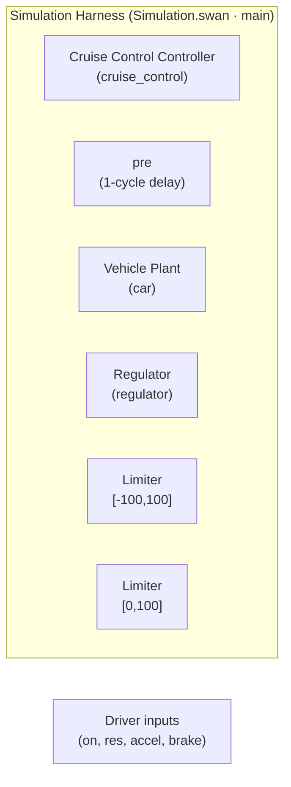
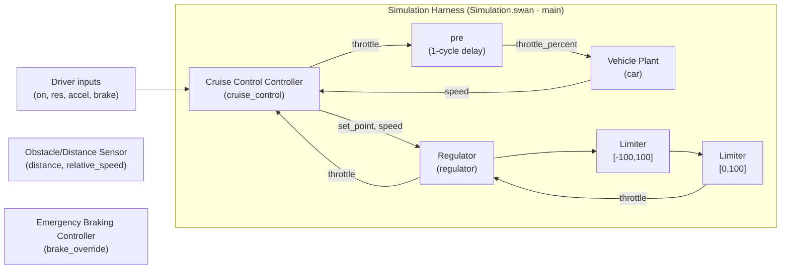

# Lab 6 — Software Architecture

**Course:** Software Engineering
**Lesson:** Software Architecture
**Duration:** 1 hour
**Tool:** None — a short recap, then the page's editable Mermaid diagram tool for three hands-on exercises
**Work mode:** Individual, written deliverable
**Recommended prerequisite:** the Lesson 6 lecture/slides on Software Architecture (this lab assumes you've already seen that material) and [Lab 4](../lab4/) (you need the Cruise Control system's requirements and Scade One model to complete Parts 1–3)

---

# Context

Lab 4 asked you to go straight from a requirement set (REQ-01–REQ-08,
written in Lab 3) to a Scade One model: a state machine, a PI regulator, a
car plant. That worked — but it skipped a step that real safety-critical
projects do not skip: **deciding the system's structure before deciding
its design.**

The Recap below brings the key vocabulary back to mind before you start.
The core of this lab is three hands-on exercises: you document the
architecture the Cruise Control system *already has* (nobody wrote it down
before Lab 4's design work began), zoom out to a whole-vehicle view, and
extend it with a new safety feature.

---

# Learning Objectives

By the end of this lab you will be able to:

- Recall, in your own words, why software architecture matters, how it
  differs from design, and the four elements (components, connectors,
  interfaces, constraints) it's made of
- Apply the requirements-driven architecture pattern from the lecture to a
  system you already know
- Produce your own component/interface/constraint description of the
  Cruise Control system's architecture
- Sketch a system-level (SysML-style) view of the *whole* vehicle system,
  not just its embedded software
- Extend that architecture with a new safety feature (automatic emergency
  braking), including proposed requirements and a description of how it
  would be simulated

---

# Recap — Software Architecture Essentials

> Quick reminder of the lecture, not a replacement for it. If any of this
> is unfamiliar, go back to the slides before starting Part 1.

- **Why it matters:** without an architecture, components get tightly
  coupled and changes get expensive; with one, you get organized structure,
  clear responsibilities, and easier evolution.
- **Definition (ISO/IEC/IEEE 42010):** a system's components, their
  relationships, and the principles guiding their design and evolution. It
  answers three questions — what are the major building blocks, how do
  they communicate, how is complexity managed?
- **Architecture vs design:** architecture is **WHAT** (major components,
  responsibilities, interfaces); design is **HOW** (algorithms, data
  structures, detailed behavior). Architecture changes are expensive
  because they affect the whole system; design changes are usually
  localized.
- **Four elements of embedded architecture — you'll use this exact
  vocabulary in Part 1:** **components** (application functions, drivers,
  middleware, HAL), **connectors** (function calls, buses, message queues,
  pub/sub), **interfaces** (provided/required services, hardware/
  communication/sensor interfaces), **constraints** (timing, memory, power,
  safety, security).
- **Quality attributes drive architecture:** most architectural decisions
  come from non-functional requirements, not functional ones — e.g. "the
  system shall respond within 100 ms" drives caching, parallelism, or
  distributed services, none of which the requirement itself mentions.
- **Requirements-driven architecture:** architecture should flow from
  requirements, with traceability running down to implementation and
  testing and back — the same idea as Lab 3's `#pragma requirement`
  mechanism, one level higher up.
- **The lecture's worked example:** an autonomous medical monitoring
  system's requirements (continuous ECG acquisition, alarm within 2
  seconds, patient data encryption, 24/7 availability) each map to a
  *specific* architectural decision — edge sensor + gateway + ingestion;
  an optimized stream/alarm pipeline; TLS + encrypted storage + key
  management; load balancer + replication + failover — no single component
  does everything. **Part 1 asks you to do that same mapping yourself, for
  a system you already know.**

---

> **Parts 1–3's diagrams are live editors, not pictures.** Each one renders
> below a text box holding its (deliberately incomplete) Mermaid source —
> boxes without their arrows, marked `%% TODO`. Edit the text and click
> **▶ Render** (or just stop typing — it re-renders automatically after
> about a second) to see your change; **↺ Reset** throws away your edits
> and restores the incomplete starting version. Edits are kept only in
> your own browser (`localStorage`) — nothing is uploaded or graded
> automatically; use the tables in each activity to work out what the
> missing arrows should be.

# Part 1 — Hands-On: The Architecture of the Cruise Control System

**Deliverable — write this down** (in a text file, or on paper, as your
instructor requires): a component table, an interface table, a constraints
list, and one diagram, all for the Lab 4 Cruise Control system.

## Activity 1A — Identify the components

Lab 4's Scade One project (`src/lab4/starter/CruiseControl/`) has never had
its architecture written down separately from its design — you're about to
be the first to do that. It has three packages, which map directly onto
architectural components:

| Component | Package / node | Responsibility |
|---|---|---|
| **Vehicle Plant** | `Car_design` → `node car(throttle_percent, brake) returns (speed, rpm, gear)` | Simulates the physical vehicle's response to throttle/brake input — stands in for the real car, never a code-generation target |
| **Cruise Control Controller** | `CC_design` → `node cruise_control(v_speed, brake, accel, on, res, set_point) returns (throttle)` | Nested state machine deciding *when* cruise control should be active (`cc_disabled`/`cc_enabled` outer, `cc_active`/`cc_standby` inner) |
| **Regulator** | `CC_design` → `node regulator(set_point, speed) returns (throttle)` | PI controller: computes the throttle needed to bring `speed` toward `set_point` |
| **Limiter** | `CC_design` → `node limiter(input, upper_limit, lower_limit) returns (output)` | Clamp/saturation block, instantiated twice inside `regulator` |
| **Simulation Harness** | `Simulation` → `node main(...)` / `node main_manual(...)` | Wires Vehicle Plant + Cruise Control Controller into a closed loop (`main`) or drives the plant directly, open-loop (`main_manual`) — never shipped/deployed, exists only for simulation |

## Activity 1B — Identify the interfaces

Each node's typed signature *is* its interface — this is exactly what the
Recap's "provided services" / "required services" distinction means in
practice:

| Component | Provided interface (outputs) | Required interface (inputs) |
|---|---|---|
| Vehicle Plant (`car`) | `speed`, `rpm`, `gear` | `throttle_percent`, `brake` |
| Cruise Control Controller (`cruise_control`) | `throttle` | `v_speed`, `brake`, `accel`, `on`, `res`, `set_point` |
| Regulator (`regulator`) | `throttle` | `set_point`, `speed` |
| Limiter (`limiter`) | `output` | `input`, `upper_limit`, `lower_limit` |

## Activity 1C — Identify the constraints

- **Real-time / deterministic:** every node is a synchronous Swan operator —
  same inputs always produce the same outputs, no hidden state beyond
  explicit `pre` (see `.agents/domain.md`'s "Synchronous operator" entry).
- **Output range:** `regulator`'s `throttle` is clamped to `[0, 100]` by an
  internal `limiter` instance (an earlier, wider clamp of `[-100, 100]` is
  applied to the intermediate PI sum first).
- **No dynamic memory / static structure:** the Swan model has a fixed set
  of nodes and connections — nothing is created or destroyed at runtime.
- **One-cycle feedback delay:** `Simulation.swan`'s closed-loop `main` node
  feeds `cruise_control`'s `throttle` output back into `car`'s
  `throttle_percent` input through a `pre` — the loop is delayed by exactly
  one simulation cycle, not instantaneous.

## Activity 1D — Draw the component diagram

**This is the deliverable for Part 1.** The diagram below only has the
five components from Activity 1A as boxes — no arrows yet. Using the
interface table from Activity 1B (who provides what, who requires what)
and the constraints from Activity 1C (the one-cycle feedback delay, the
two `limiter` clamp stages), edit the box below and replace every `%% TODO`
line with the real connector(s) it describes. Click **▶ Render** to see
your diagram; use **↺ Reset** if you want to start over.

## Reflection

This diagram and these tables describe an architecture that already exists
in code — nobody designed it top-down as architecture-first. That's the
point: **architecture-first is what should have happened before Lab 4's
Part 3 ("create the cruise_control operator interface")**. Doing it
retroactively here still gives you the same artifact — a documented,
traceable structure — just later than the standards discussed in Lab 5
(DO-178C, ISO 26262, etc. — mentioned only as educational context, not a
compliance claim) would recommend.

---

# Part 2 — Hands-On: System-Level View (SysML-Style)

Part 1 stayed inside the embedded-software boundary — the four Swan
packages. A real vehicle's cruise control system is bigger than its
software: it includes the driver, physical sensors and actuators, and a
communication bus. This activity asks you to zoom out.

## Activity 2A — Draw the whole-system block diagram

> **Caveat:** the diagram below is a **SysML-style** block diagram —
> boxes for parts, arrows for connections/flows — drawn in Mermaid, because
> this repo has no SysML modeling tool installed. It is not output from a
> real SysML tool (e.g. a `.sysml`/Capella/Papyrus export), and should not
> be read as one.

**This is the deliverable for Part 2.** The boxes below are the parts of
the whole vehicle system — driver, HMI, three sensors, the signal bus, the
Cruise Control ECU (collapse Part 1's entire diagram into this one box),
the throttle actuator, and the vehicle itself. None of them are connected
yet. Replace the `%% TODO` lines with arrows showing which signal flows
where — think about which sensors feed the bus, what the ECU needs as
input and produces as output, and how the actuator's effect eventually
loops back to the sensors.

```mermaid-edit
flowchart TB
    Driver["Driver"]
    HMI["HMI / Dashboard"]
    Bus["Vehicle Signal Bus (CAN-style)"]
    WheelSensor["Wheel-Speed Sensor"]
    BrakeSensor["Brake Pedal Sensor"]
    AccelSensor["Accelerator Pedal Sensor"]
    ECU["Cruise Control ECU<br/>(embedded software — Part 1's box)"]
    Powertrain["Throttle / Powertrain Actuator"]
    Vehicle["Vehicle Dynamics<br/>(physical car — Part 1 models this as 'car')"]
    %% TODO: Driver -> HMI (on / res / set / brake pedal / accelerator pedal)
    %% TODO: HMI -> Bus (on, res, set_point request)
    %% TODO: each sensor -> Bus (v_speed, brake, accel)
    %% TODO: Bus -> ECU (all sensor + HMI signals the ECU needs)
    %% TODO: ECU -> Bus -> Powertrain (throttle command)
    %% TODO: Powertrain -> Vehicle (applies torque)
    %% TODO: Vehicle -> WheelSensor (actual speed, closing the loop)
    %% TODO: HMI -> Driver (status display)
```

Compare your finished diagram to Part 1's: the **Cruise Control ECU** box
here is the *entire* Part 1 diagram, collapsed into one box — each level of
an architecture hides the detail of the level below it, which is exactly
how architecture manages complexity in practice: at the vehicle level, you
don't need to see `regulator`'s internal `limiter` instances; at the
software level, you don't need to see the wheel-speed sensor's electrical
interface.

---

# Part 3 — Hands-On: Extending the Architecture — Automatic Emergency Braking

This is a **paper design exercise**. Nothing here is implemented in
`src/lab4/starter/CruiseControl/` — the shipped Scade One model, its
generated wrapper, and its scenario CSVs are **not** modified by this lab.
You are practicing requirements-driven architecture on a *new* feature, the
same way the Recap's medical-monitoring example was worked for you.

## Activity 3A — Propose the new component

Add an **Emergency Braking Controller** and an **Obstacle/Distance Sensor**
to the architecture from Parts 1–2:

| Component | Responsibility |
|---|---|
| Obstacle/Distance Sensor | Measures `distance` to the nearest obstacle ahead and `relative_speed` toward it |
| Emergency Braking Controller | If a collision risk is detected, outputs a `brake_override` command that takes priority over both the driver's brake pedal and the Cruise Control Controller's `throttle` output |

**Interface:**

| Component | Provided interface | Required interface |
|---|---|---|
| Obstacle/Distance Sensor | `distance`, `relative_speed` | (physical sensing hardware — outside the software boundary) |
| Emergency Braking Controller | `brake_override` (bool/float) | `distance`, `relative_speed`, `v_speed` |

**Connector / arbitration:** the Emergency Braking Controller's
`brake_override` and the driver's manual `brake` both feed into the same
actuator; when `brake_override` is active it takes priority over the
Cruise Control Controller's `throttle` command — i.e. it is a new connector
into the *existing* architecture from Part 1, not a replacement for it.

## Activity 3B — Propose requirements (EARS)

The requirement IDs already in use across this repo are REQ-01 through
REQ-08 (REQ-01–06 from Lab 2, REQ-07/08 added in Lab 3/4 for the
regulator). The next free IDs are REQ-09/REQ-10. Write them in EARS syntax,
the same style taught in Lab 3 Part 1:

> **REQ-09 (proposed — not implemented in the shipped model)** — IF the
> Obstacle/Distance Sensor reports a collision risk (e.g. `distance` below
> a safety threshold given the current `relative_speed`), THEN the
> Emergency Braking Controller shall set `brake_override` to override both
> the driver's brake input and the Cruise Control Controller's `throttle`
> output.
>
> **REQ-10 (proposed — not implemented in the shipped model)** — WHILE
> `brake_override` is active, the Cruise Control Controller shall remain in
> `cc_standby` (or `cc_disabled`) and shall not resume regulation until
> `brake_override` clears and the driver issues `res`.

These two IDs are explicitly marked **proposed** — this lab does not add
them to `src/lab3/solution/requirements.md` or to `CC_design.swan`. That
would require a real maintainer/instructor decision and a Scade One
session, exactly the same boundary Lab 4's Activity 7A draws around its own
unfinished traceability links.

## Activity 3C — How would you simulate it?

You don't need to write code for this — describe the approach in a
sentence or two, using the mechanism Lab 4 Part 6 already built:

Lab 4's `evaluate_cc_full_report.py` drives the generated wrapper
cycle-by-cycle from `scenarios/*.csv`, one row per simulation cycle, with
optional `expected_throttle`/`req`/`note` columns. Extending it for REQ-09/
REQ-10 would mean: (1) adding an `obstacle_distance` (and optionally
`relative_speed`) column to the scenario CSV schema, (2) adding rows where
`obstacle_distance` drops below the safety threshold mid-scenario, tagged
`req = REQ-09`, and (3) checking — the same way REQ-07 already is (Lab 3's
Activity 5A reference answer) — that the *trend* is right: `brake_override`
should engage and `throttle` should fall, rather than asserting one exact
value. This is a description of an extension, not a new script — no file
under `src/lab4/` is created or changed by this lab.

## Activity 3D — Draw the extended architecture

**This is the deliverable for Part 3.** The diagram below starts from your
finished Part 1 diagram (already wired — copy your own version in if you
changed anything) plus two new, unconnected boxes: the Obstacle/Distance
Sensor and the Emergency Braking Controller from Activity 3A. Wire them
in: both new boxes need connections, and the existing `brake`/`throttle`
paths need to show the arbitration rule from Activity 3A (an emergency
override takes priority over both the driver's brake and the regulator's
throttle command).

## Reflection

Notice this activity re-used Part 1's diagram as a starting point instead
of starting from nothing — that's what "architecture is driven by
requirements, and requirements evolve" looks like in practice: a new
requirement (REQ-09/REQ-10) extends an existing architecture, it doesn't
replace it.

---

# Summary

- **Software architecture is the blueprint of a system** — it defines the
  system's high-level structure, major components, interfaces, and
  interactions *before* implementation begins, and it should be driven by
  requirements rather than technology choices.
- **Architecture and design are different activities** — Lab 4 built a
  correct Cruise Control design without ever writing its architecture down
  first; Part 1 of this lab shows that the architecture was there all
  along, just undocumented, and that documenting it after the fact is
  still useful, even if doing it *before* design is the better order.
- **Architecture scales across levels** — Part 1's software-only view and
  Part 2's whole-vehicle view describe the same system at two different
  levels of abstraction, each hiding the detail of the level below it.
- **A well-documented architecture pays off downstream** — better
  traceability, easier validation, better maintainability, more
  predictable quality, less redesign effort, and (mentioned only as
  educational/reflection context, not a compliance claim about this repo)
  easier certification.

---

# Quiz

Answer the ten questions below to check your understanding of this lab's
material.

  

    <strong>Q1 — According to ISO/IEC/IEEE 42010, software architecture consists of a system's components, their relationships, and the principles guiding their design and evolution. Which question does architecture NOT primarily answer?</strong>
    <label class="quiz-option"><input type="radio" name="q1" value="a">What are the major building blocks?</label>
    <label class="quiz-option"><input type="radio" name="q1" value="b">What exact algorithm does each function use internally?</label>
    <label class="quiz-option"><input type="radio" name="q1" value="c">How do the building blocks communicate?</label>
    <label class="quiz-option"><input type="radio" name="q1" value="d">How is complexity managed?</label>
  

  

    <strong>Q2 — A team skips architecture and lets every module call every other module directly as the system grows. Which consequence does the lesson predict?</strong>
    <label class="quiz-option"><input type="radio" name="q2" value="a">Reuse becomes easier</label>
    <label class="quiz-option"><input type="radio" name="q2" value="b">Quality attributes become easier to achieve</label>
    <label class="quiz-option"><input type="radio" name="q2" value="c">Components become tightly coupled and changes become expensive</label>
    <label class="quiz-option"><input type="radio" name="q2" value="d">Testing becomes easier</label>
  

  

    <strong>Q3 — Which statement best distinguishes architecture from design?</strong>
    <label class="quiz-option"><input type="radio" name="q3" value="a">Architecture defines major components and their responsibilities (WHAT); design defines the detailed implementation (HOW)</label>
    <label class="quiz-option"><input type="radio" name="q3" value="b">Architecture and design are two names for the same activity</label>
    <label class="quiz-option"><input type="radio" name="q3" value="c">Design always happens before architecture</label>
    <label class="quiz-option"><input type="radio" name="q3" value="d">Architecture is only concerned with class-level method signatures</label>
  

  

    <strong>Q4 — A change to the architecture (e.g. splitting one service into two) is typically more expensive than a change to the design of one function. Why?</strong>
    <label class="quiz-option"><input type="radio" name="q4" value="a">Architecture changes never affect other components</label>
    <label class="quiz-option"><input type="radio" name="q4" value="b">Design changes always require full system re-certification</label>
    <label class="quiz-option"><input type="radio" name="q4" value="c">Architecture has no impact on system quality</label>
    <label class="quiz-option"><input type="radio" name="q4" value="d">Architecture decisions impact the whole system, while design changes are typically localized</label>
  

  

    <strong>Q5 — In embedded software architecture, which pairing correctly matches an element to an example?</strong>
    <label class="quiz-option"><input type="radio" name="q5" value="a">Constraint — a message queue between two tasks</label>
    <label class="quiz-option"><input type="radio" name="q5" value="b">Connector — a CAN bus carrying signals between the cruise control ECU and a sensor</label>
    <label class="quiz-option"><input type="radio" name="q5" value="c">Component — a real-time performance budget of 10 ms</label>
    <label class="quiz-option"><input type="radio" name="q5" value="d">Interface — the device driver implementation itself</label>
  

  

    <strong>Q6 — A requirement states "the system shall respond within 100 ms." Which of the following is this requirement's quality attribute, and what kind of architectural decision does it typically drive?</strong>
    <label class="quiz-option"><input type="radio" name="q6" value="a">Security — it drives the choice of an encryption algorithm</label>
    <label class="quiz-option"><input type="radio" name="q6" value="b">Portability — it drives the choice of programming language</label>
    <label class="quiz-option"><input type="radio" name="q6" value="c">Performance — it may drive caching, parallel processing, or distributed services</label>
    <label class="quiz-option"><input type="radio" name="q6" value="d">Maintainability — it drives the choice of variable naming conventions</label>
  

  

    <strong>Q7 — In the Lab 4 Cruise Control system's architecture (Part 1), which pairing is correct?</strong>
    <label class="quiz-option"><input type="radio" name="q7" value="a">The Vehicle Plant (`car`) is a component whose required interface includes `throttle_percent` and `brake`</label>
    <label class="quiz-option"><input type="radio" name="q7" value="b">The `limiter` node is a communication bus, not a component</label>
    <label class="quiz-option"><input type="radio" name="q7" value="c">The Cruise Control Controller's provided interface includes `v_speed` as an output</label>
    <label class="quiz-option"><input type="radio" name="q7" value="d">`Simulation.swan` is part of the shipped/deployed production architecture</label>
  

  

    <strong>Q8 — Why does Part 2's whole-vehicle diagram collapse the entire Part 1 software architecture into a single "Cruise Control ECU" box?</strong>
    <label class="quiz-option"><input type="radio" name="q8" value="a">Because the software architecture is irrelevant at the vehicle level</label>
    <label class="quiz-option"><input type="radio" name="q8" value="b">Because SysML tools cannot represent embedded software</label>
    <label class="quiz-option"><input type="radio" name="q8" value="c">Because the regulator and limiter nodes no longer exist at that level</label>
    <label class="quiz-option"><input type="radio" name="q8" value="d">Because each level of architecture hides the detail of the level below it, managing complexity</label>
  

  

    <strong>Q9 — Part 3 proposes REQ-09/REQ-10 for an Automatic Emergency Braking extension. What is the correct status of this proposal in this repository?</strong>
    <label class="quiz-option"><input type="radio" name="q9" value="a">REQ-09/REQ-10 are implemented and traced inside the shipped `CC_design.swan`</label>
    <label class="quiz-option"><input type="radio" name="q9" value="b">REQ-09/REQ-10 are a proposed, paper-only extension — not implemented in the shipped model or scenarios</label>
    <label class="quiz-option"><input type="radio" name="q9" value="c">REQ-09/REQ-10 replace REQ-01 and REQ-02</label>
    <label class="quiz-option"><input type="radio" name="q9" value="d">REQ-09/REQ-10 were auto-generated by `evaluate_cc_full_report.py`</label>
  

  

    <strong>Q10 — Which best summarizes this lab's central lesson about Lab 4?</strong>
    <label class="quiz-option"><input type="radio" name="q10" value="a">Lab 4's design was incorrect because no architecture existed</label>
    <label class="quiz-option"><input type="radio" name="q10" value="b">Architecture and design are the same activity, so Lab 4 lost nothing by skipping it</label>
    <label class="quiz-option"><input type="radio" name="q10" value="c">Lab 4's design worked, but its architecture was never written down first — documenting it afterward is still useful, though doing it beforehand is the better practice</label>
    <label class="quiz-option"><input type="radio" name="q10" value="d">Requirements are unnecessary once an architecture exists</label>
  

  

    <button id="quiz-submit" type="button">Check Answers</button>
    <button id="quiz-reset" type="button">Try Again</button>
    
  

