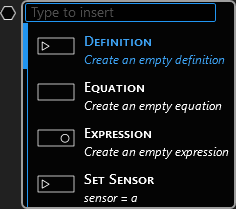
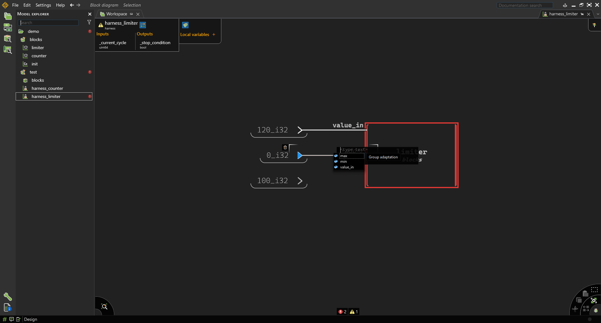
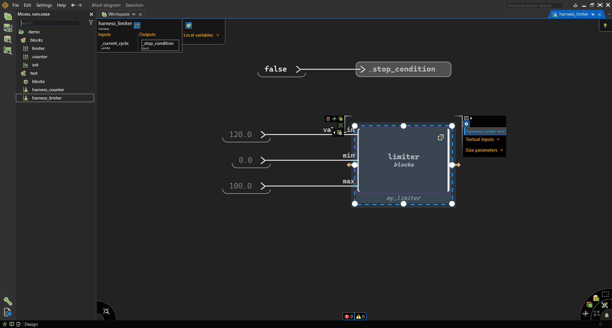
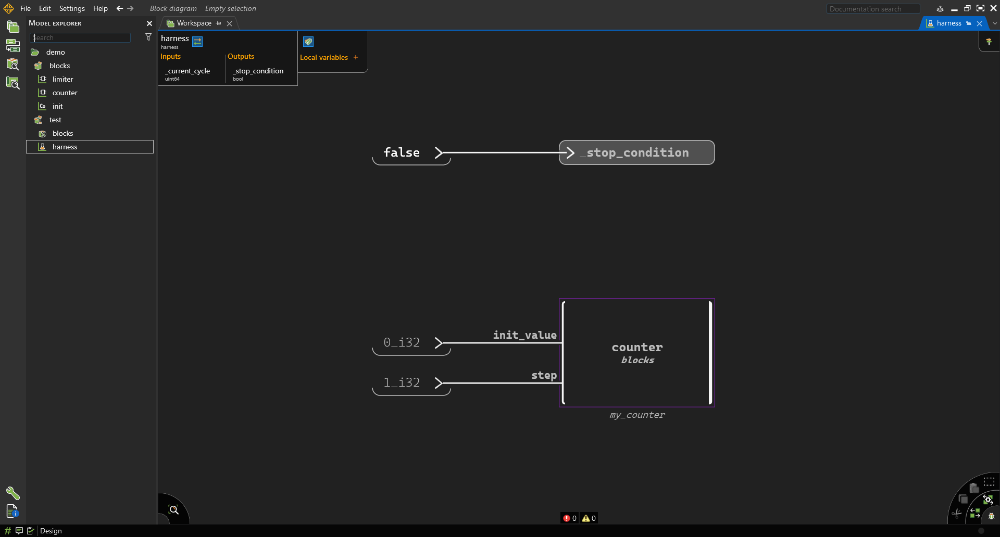

# Lab 3 — Introduction to Scade One: Modeling Combinatorial and Sequential Logic

**Course:** Software Engineering  
**Lesson:** Model-Based Design with Scade One  
**Duration:** 2–3 hours  
**Tool:** Ansys Scade One Student Edition  
**Work mode:** Individual

---

# Context

This lab introduces the fundamentals of **Model-Based Design (MBD)** using **Scade One**.

Unlike traditional programming:
- systems are designed graphically
- the model itself is executable
- testing is integrated into the design workflow
- code can later be generated automatically

This lab focuses on two fundamental categories of digital systems:

| Type | Meaning |
|---|---|
| **Combinatorial Logic** | Output depends only on current inputs |
| **Sequential Logic** | Output depends on previous states/history |

You will implement:
1. A **Limiter** (combinatorial logic)
2. A **Counter** (sequential logic)
3. A **Test Harness** for each model

---

# Learning Objectives

By the end of this lab you will be able to:

- Create Scade One projects and modules
- Create operators with typed interfaces
- Implement combinatorial logic
- Implement sequential logic using delays (`pre`)
- Simulate models
- Create and configure test harnesses
- Run automated simulations

---

# Prerequisites

### 1 — Install Scade One Student Edition

Download and install the free student version:

**→ [Ansys SCADE Student Free Software Download](https://www.ansys.com/academic/students/ansys-scade-student)**


<!-- <p align="center">
  
</p> -->

> After installing, register for a free student licence on the same page. The licence is required to save and simulate models.

### 2 — Complete the QuickStart tutorial

Before starting this lab, watch and follow the official quickstart:

**→ [Scade One Student — Quick Getting Started (YouTube)](https://www.youtube.com/watch?v=ww5-sx8U0lc)**

This covers: creating a project, declaring inputs/outputs, drawing a state machine, and running the simulator. You will need all of these in this lab.

### 3 — Watch the overview (optional but recommended)

**→ [Scade One Overview (YouTube)](https://www.youtube.com/watch?v=5XgZ00hExZ8&list=PLofSocOk8HEnPCfGOQOBDwLdlmajvBxqZ&index=2)**


---

## Activity 1B — Create a Swan Module

Inside the project:

```text
New → Swan Module
```

Name it:

```text
blocks
```

This module will contain reusable operators.

---

# Part 2 — Combinatorial Logic: Limiter

---

# Theory

A **combinatorial system** computes outputs only from current inputs.

There is:
- no memory
- no previous state
- no delay

Equivalent software example:

```python
if value > max:
    output = max
elif value < min:
    output = min
else:
    output = value
```

This type of logic is frequently used for:
- saturation
- validation
- range checking
- signal conditioning


 

---

## Activity 2A — Create the Operator

Inside `blocks`:

```text
New → Operator
```

Name:

```text
limiter
```

---

## Activity 2B — Define the Interface

Add the following:

| Name | Type | Direction |
|---|---|---|
| `row_cmd` | `float64` | Input |
| `min` | `float64` | Input |
| `max` | `float64` | Input |
| `cmd` | `float64` | Output |

---


## Activity 2C — Implement the Logic

Implement the following behavior:

```python
if row_cmd > max:
    cmd = max
elif row_cmd < min:
    cmd = min
else:
    cmd = row_cmd
```

Use:
- comparison blocks (`>`, `<`)
- conditional/switch blocks
- direct signal connections

Your completed model should resemble:
- upper branch → saturation at maximum
- lower branch → saturation at minimum
- otherwise pass-through


## Understanding Definition vs Expression


 

When right-clicking in a Scade diagram, you will frequently use:

```text
Definition
Expression
```

These are the two most important modeling elements.

| Element | Use it for |
|---|---|
| **Expression** | Computations and values |
| **Definition** | Named outputs/signals |

---

### Use **Expression** when you want:

- constants
- arithmetic
- comparisons
- delays (`pre`)
- intermediate computations

Examples:

```text
0_i32
0.0_f64
+
-
>
<
pre
```

Think:

```text
"Compute something"
```

---

### Use **Definition** when you want:

- an output
- a local variable
- a named signal

Examples:

```text
count
cmd
old_speed
```

Think:

```text
"Store or expose a result"
```

---

## Important Beginner Rule

Most diagrams follow this structure:

```text
Expression → Expression → Definition
```

Example:

```text
speed → > → switch → cmd
```

Where:
- `>` is an Expression
- `switch` is an Expression
- `cmd` is a Definition

---

## Typical Mistake

### Wrong

Creating an Expression for the final output.

Result:
- dangling wire
- unnamed signal
- missing output

---

### Correct

End the logic with a Definition:

```text
(+ block) → count
```

where:
- `+` is an Expression
- `count` is a Definition

---

## Activity 2D — Generate and Simulate

Generate the model:

```text
Design → Generate
```

Fix any:
- type mismatches
- unconnected signals
- undefined references

Switch to simulation mode.

Test the following values:

| row_cmd | min | max | Expected cmd |
|---|---|---|---|
| 5 | 0 | 10 | 5 |
| 20 | 0 | 10 | 10 |
| -5 | 0 | 10 | 0 |

---

# Part 3 — Test Harness for Combinatorial Logic

---

# Theory

A **Test Harness** is a test environment around an operator.

It:
- injects inputs
- executes the model
- observes outputs
- automates testing

---

## Activity 3A — Create Test Module

Create a module:

```text
test
```

---

## Activity 3B — Import the Blocks Module

Inside `test`, add:

```swan
use blocks;
```

---

## Activity 3C — Create Harness

Create:

```text
New → Harness
```

Name:

```text
limiter_harness
```

---

## Activity 3D — Add Operator Under Test

Drag `limiter` into the harness diagram.

Connect constants:

| Signal | Value |
|---|---|
| `row_cmd` | `20.0_f64` |
| `min` | `0.0_f64` |
| `max` | `10.0_f64` |

---

## Activity 3E — Configure the Harness

Select the operator instance.

Enable:

```text
Operator under test
```


 

  

---

## Activity 3F — Configure Stop Condition

Connect: ```false``` to: ```_stop_condition```

Configure the block as ```Operator under test```

  


---

## Activity 3G — Run the Harness

Run simulation.

Expected output:

```text
cmd = 10.0
```

because:
- input exceeds maximum
- limiter saturates output

---

# Part 4 — Sequential Logic: Counter

---

# Theory

A **sequential system** depends on:
- current inputs
- previous outputs/state

Sequential systems require:
- memory
- delays
- state variables

Scade One uses:
- `pre`
- initialized delays (`->`)

for stateful behavior.


 

---

## Activity 4A — Create the Counter Operator

Inside `blocks`:

```text
New → Operator
```

Name:

```text
counter
```

---

## Activity 4B — Define the Interface

Add:

| Name | Type | Direction |
|---|---|---|
| `init_value` | `int32` | Input |
| `step` | `int32` | Input |
| `count` | `int32` | Output |

---

## Activity 4C — Implement Sequential Logic

Behavior:

```python
count = previous_count + step
```

Use:
- `pre`
- `+`
- initialized delay

Equivalent Scade equation:

```text
count = init_value -> pre(count) + step
```

or equivalently:

```text
old_count = init_value -> pre(count)
count = old_count + step
```

---

## Activity 4D — Simulate

Use:
- `init_value = 0`
- `step = 1`

Run multiple cycles.

Expected behavior:

| Cycle | Count |
|---|---|
| 0 | 0 |
| 1 | 1 |
| 2 | 2 |
| 3 | 3 |

---

# Part 5 — Test Harness for Sequential Logic

---

## Activity 5A — Create Harness

Create:

```text
counter_harness
```

inside the `test` module.


 

---

## Activity 5B — Add Operator Under Test

Drag and drop the `counter` block into the harness.

Connect:

| Signal | Value |
|---|---|
| `init_value` | `0_i32` |
| `step` | `1_i32` |

---

## Activity 5C — Configure DUT

Enable:

```text
Operator under test
```

for the counter instance.

---

## Activity 5D — Configure Stop Condition

Connect:

```text
false
```

to:

```text
_stop_condition
```

---

## Activity 5E — Run Sequential Simulation

Execute multiple cycles.

Observe:
- the counter value increases at each cycle
- the operator now has memory/state

---

# Part 6 — Comparing Combinatorial vs Sequential Logic

---

| Feature | Combinatorial | Sequential |
|---|---|---|
| Depends on current inputs | Yes | Yes |
| Depends on previous state | No | Yes |
| Uses memory | No | Yes |
| Uses `pre` | No | Yes |
| Uses delays | No | Yes |
| Example | Limiter | Counter |

---

# Common Errors

---

## Undefined Reference

Cause:
- missing:

```swan
use blocks;
```

---

## Missing Operator Under Test

Cause:
- DUT not configured

Fix:
- select operator
- enable:

```text
Operator under test
```

---

## Undetermined Literal Type

Incorrect:

```text
0
```

Correct:

```text
0_i32
0.0_f64
```

---

## Invalid Delay Initialization

Cause:
- incorrect `pre` usage

Correct form:

```text
x = init -> pre(x)
```

---

# Reflection Questions

Answer briefly:

1. What is the difference between combinatorial and sequential logic?
2. Why does sequential logic require memory?
3. Why does Scade require explicit signal types?
4. What advantages do test harnesses provide?
5. Why is model-based design useful in safety-critical systems?

---

# Deliverables

Submit:

| File | Description |
|---|---|
| `logic_demo/` | Full Scade One project |
| Screenshots | Simulations and harness execution |
| `answers.md` | Reflection answers |

---

# Key Takeaway

In Scade One:
- graphical models are executable
- combinatorial systems react instantly
- sequential systems maintain state
- testing is integrated into the workflow
- harnesses automate verification

These concepts form the foundation of Model-Based Design (MBD).