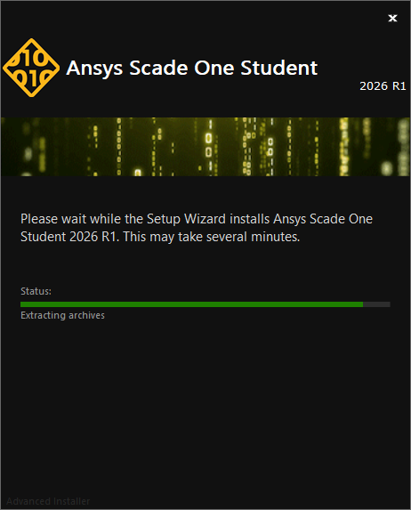
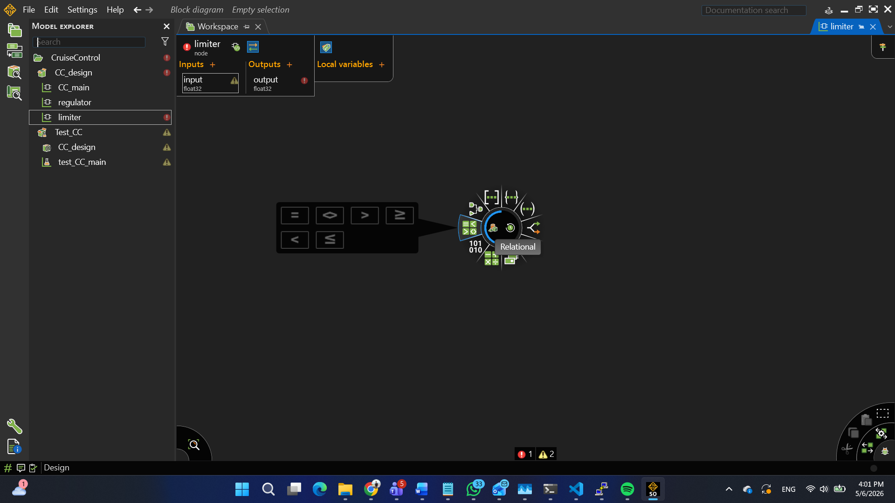
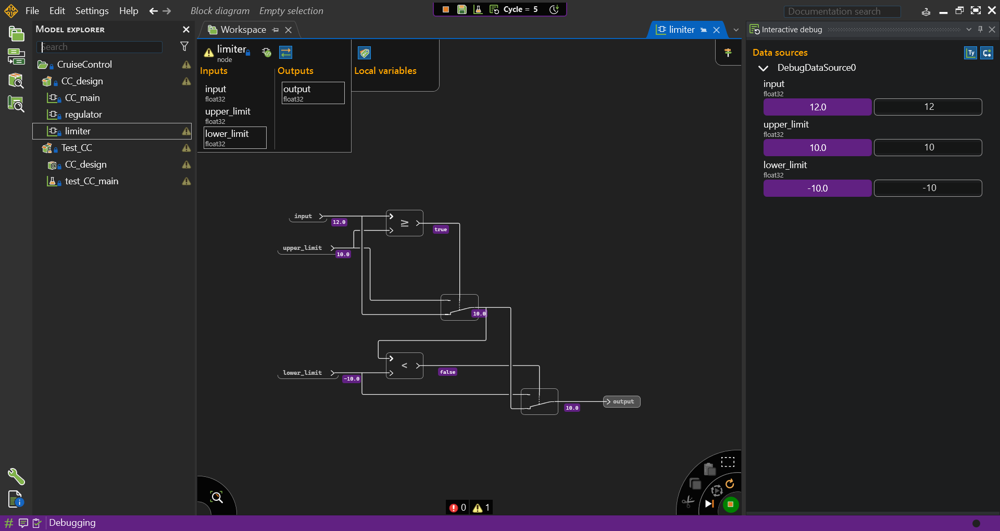
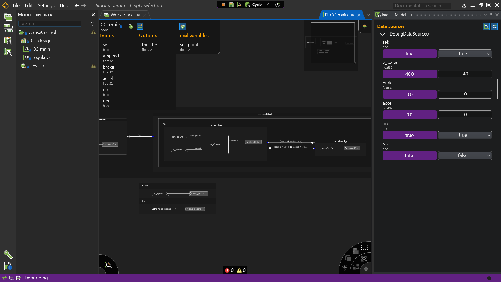
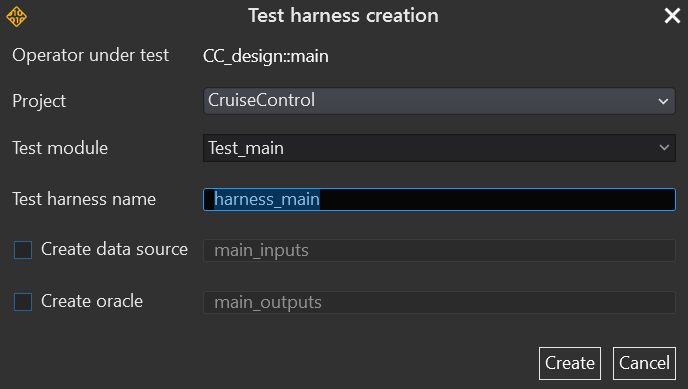
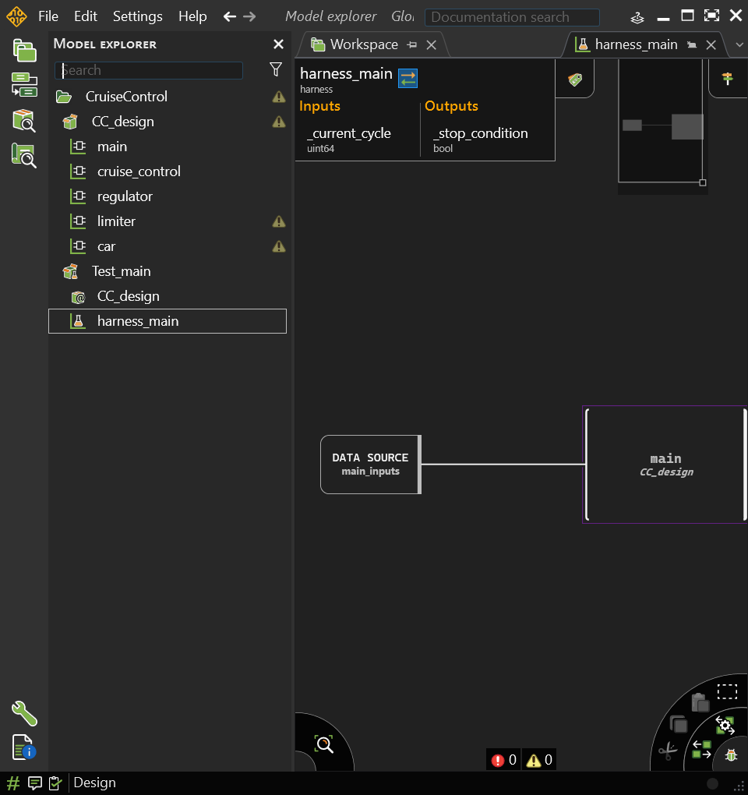

# Lab 3 — Implementing Cruise Control in Scade One

**Course:** Software Engineering &nbsp;·&nbsp; **Lesson:** Model-Based Design with Scade One  
**Duration:** 2–3 hours &nbsp;·&nbsp; **Tool:** Ansys Scade One (Student Edition) &nbsp;·&nbsp; **Work mode:** Individual  
**Prerequisite:** [Lab 2 — Applying the SDLC (Python)](../lab2-interactive/docs/)

---

## Context

In Lab 2 you implemented the cruise control safety logic in Python, working through all SDLC phases manually — requirements, decision table, implementation, V&V, and traceability.

In this lab you implement the **same system** in **Scade One** — the industrial model-based design tool used in aerospace, automotive, and railway. You will see how every phase you did by hand in Python maps directly to a Scade One feature:

| What you did manually in Lab 2 | What Scade One provides |
|-------------------------------|------------------------|
| Decision table on paper | Graphical state machine editor |
| Python function with comments | Operator with typed interface |
| `run_tests()` by hand | Simulation and Python test harness |
| Traceability matrix as comments | Built-in requirement tracing |
| `pass` → implement | Code generation (certified C) |

---

## Prerequisites

### 1 — Install Scade One Student Edition

Download and install the free student version:

**→ [Ansys SCADE Student Free Software Download](https://www.ansys.com/academic/students/ansys-scade-student)**



<!-- <p align="center">
  
</p> -->

> After installing, register for a free student licence on the same page. The licence is required to save and simulate models.

### 2 — Complete the QuickStart tutorial

Before starting this lab, watch and follow the official quickstart:

**→ [Scade One Student — Quick Getting Started (YouTube)](https://www.youtube.com/watch?v=ww5-sx8U0lc)**

This covers: creating a project, declaring inputs/outputs, drawing a state machine, and running the simulator. You will need all of these in this lab.

### 3 — Watch the overview (optional but recommended)

**→ [Scade One Overview (YouTube)](https://www.youtube.com/watch?v=5XgZ00hExZ8&list=PLofSocOk8HEnPCfGOQOBDwLdlmajvBxqZ&index=2)**

---

## Objectives

By the end of this lab you will be able to:

- Create a Scade One project with a correctly typed operator interface
- Model the cruise control decision table as a graphical state machine
- Run the built-in Scade One simulator to verify behaviour
- Write a Python test harness that calls the generated C code to reproduce the 7 test cases from Lab 2
- Explain how model-based design replaces the manual traceability you maintained in Lab 2

---

## Structure

| Part | Topic | Time |
|------|-------|------|
| 0 | Scade One orientation | 15 min |
| 1 | Project setup & operator interface | 20 min |
| 2 | State machine design | 30 min |
| 3 | Simulation & manual verification | 20 min |
| 4 | Python test harness | 30 min |
| 5 | Traceability & reflection | 15 min |

---

## The System (recap from Lab 2)

You are modelling the `CC_main` operator — the top-level cruise control node visible in Scade One. The system has **three states** (`OFF`, `SUSPENDED`, `ACTIVE`) and the following interface:


<!--  -->

<!-- <p align="center">
  
</p> -->

 


**Inputs:**

| Name | Type | Description |
|------|------|-------------|
| `set` | `bool` | Driver presses activate |
| `v_speed` | `float32` | Current vehicle speed (km/h) |
| `brake` | `float32` | Brake pedal (0.0 – 1.0) |
| `accl` | `float32` | Accelerator pedal (0.0 – 1.0) |
| `on` | `bool` | CC system on/off |
| `res` | `bool` | Driver explicitly reactivates after SUSPENDED |

**Output:**

| Name | Type | Description |
|------|------|-------------|
| `throttle` | `float32` | Throttle command to engine (0.0 – 1.0) |

> **Note:** This interface matches the `CC_main` node shown in the Scade One screenshot. The full system also contains a `regulator` suboperator (PI controller) — you will stub that in Part 2 and optionally implement it in Part 5.


---

## Part 0 — Scade One Orientation

Before building anything, take 5 minutes to locate these elements in Scade One:

- **Model Explorer** (left panel) — shows the project tree: packages, operators, types
- **Workspace / Block Diagram** (centre) — where you draw the graphical design
- **Inputs / Outputs / Local Variables** panel — where you declare the interface
- **Design / Simulation** toggle (bottom toolbar) — switch between edit and run mode

> If anything is unclear, refer back to the quickstart tutorial linked above.

---

## Part 1 — Project Setup & Operator Interface

### Activity 1A — Create the project

1. Open Scade One → **File → New Project**
2. Name the project `CruiseControl`
3. Inside the project, create a **package** named `CC_design`
4. Inside `CC_design`, create a **node** (operator) named `CC_main`

> **Naming rule (SDR 1–3 from the training document):** names should match the SRS, each word starts with uppercase, separators only used with ALL\_CAPS constants.

### Activity 1B — Declare the interface

 


In the `CC_main` operator, declare the inputs and output from the table above. Use `bool` and `float32` as types.

Your interface panel should look like this when complete:

```
Inputs:   set (bool)  |  v_speed (float32)  |  brake (float32)
          accl (float32)  |  on (bool)  |  res (bool)

Outputs:  throttle (float32)
```

> **Question (write in your lab notes):** Compare this interface to `update_cruise_control()` in Lab 2. Which inputs correspond to `driver_activates`, `driver_reactivates`, and `brake_pressed`? What is new?

### Activity 1C — Add a local state variable

Add a **local variable** `set_point` of type `float32` to store the target cruise speed. This will be updated when the driver sets a new speed.

---

## Part 2 — State Machine Design

### Activity 2A — Create the state machine

In the `CC_main` body, insert a **State Machine** block. Create the three states from Lab 2:

| State name in Scade One | Meaning |
|------------------------|---------|
| `OFF_st` | System off — throttle follows accelerator |
| `Regulation_enabled_st` | CC active — contains the regulator |
| `not_regulating` | Suspended — waiting for explicit reactivation |

> These names match the state machine visible in the screenshot. The `Regulation_enabled_st` state contains a nested `really_regulating_st` substate with the `regulator` operator instance.

### Activity 2B — Draw the transitions

Add transitions following your decision table from Lab 2. Map each row to a transition guard:

| From | Guard condition | To | REQ |
|------|-----------------|----|-----|
| `OFF_st` | `on` | `Regulation_enabled_st` | REQ-01 |
| `Regulation_enabled_st` | `brake > 10.0 or accl > 10.0` | `not_regulating` | REQ-02, REQ-04 |
| `not_regulating` | `res` | `Regulation_enabled_st` | REQ-04 |
| `not_regulating` | `set` (no `res`) | `not_regulating` *(stays)* | REQ-04 |
| `OFF_st` | `not on` | `OFF_st` *(stays)* | — |

> **⚠️ Key rule:** The `not_regulating` → `Regulation_enabled_st` transition requires `res` (explicit reactivation), **not** just `set`. This is the same trap as TC-05 in Lab 2. Check your guard carefully.

### Activity 2C — Add state actions

In each state, set the `throttle` output:

- `OFF_st`: `throttle = accl` (driver controls throttle directly)
- `Regulation_enabled_st` / `really_regulating_st`: `throttle` = output of the `regulator` suboperator
- `not_regulating`: `throttle = accl` (same as OFF — accelerator takes over)

For the `regulator`, you can use a **stub** for now: a simple gain block `throttle = 0.5 * set_point` — just enough to get a non-zero output. The full PI controller implementation is optional (see Part 5).

### Activity 2D — Handle `set_point`

Add the `set_point` logic below the state machine using an **if/else** block:

```
if set:
    set_point = v_speed      -- store current speed as target
else:
    set_point = last 'set_point   -- keep previous value
```

This corresponds to the `set_point` panel visible at the bottom of the Scade One screenshot.

---

## Part 3 — Simulation & Manual Verification


 


 

 Create test harness

  


   Configure test harness

  


### Activity 3A — Build and launch the simulator

1. Click **Design → Generate** (or press F7) to check the model for errors
2. Fix any type mismatches or unconnected wires reported in the output panel
3. Switch to **Simulation** mode (bottom toolbar)
4. Set initial values: `on = false`, `set = false`, `brake = 0.0`, `accl = 0.5`, `v_speed = 0.0`

### Activity 3B — Reproduce the Lab 2 test cases manually

Step through each scenario below using the simulator's step button. Record the `throttle` output and the active state for each:

| Scenario | Inputs to set | Expected active state | Expected throttle behaviour |
|----------|--------------|----------------------|-----------------------------|
| S-01 | `on = true`, `v_speed = 80`, `set = true` | `Regulation_enabled_st` | Controlled by regulator |
| S-02 | Then `brake = 15.0` | `not_regulating` | Returns to `accl` |
| S-03 | Then `set = true` (no `res`) | `not_regulating` *(stays)* | Still `accl` — key trap |
| S-04 | Then `res = true` | `Regulation_enabled_st` | Returns to regulator |
| S-05 | `on = false` | `OFF_st` | Follows `accl` |

> **S-03 is the key test** — same as TC-05 in Lab 2. If your model incorrectly transitions to `Regulation_enabled_st` when `set = true` but `res = false`, you have the same REQ-04 bug. Fix the transition guard.

### Activity 3C — Note the difference

Write 2–3 sentences in your lab notes: what did Scade One catch for you during the build step (Activity 3A) that you had to catch yourself in Lab 2?

---

## Part 4 — Python Test Harness

Scade One can generate C code from your model and expose it via a Python wrapper. This lets you reproduce the exact test suite from Lab 2 automatically.

**Reference:** [Testing Scade One models with Python](https://innovationspace.ansys.com/knowledge/forums/topic/testing-scade-one-models-with-python/)

### Activity 4A — Generate C code

1. In Scade One: **Generate → KCG C Code** for the `CC_main` operator
2. Note the output folder — it contains `CC_main.c`, `CC_main.h`, and supporting files

### Activity 4B — Python test harness

Create a file `test_cc_main.py` in the generated code folder. The structure mirrors `run_tests()` from Lab 2, but calls the generated C function via the Scade One Python bridge instead of your Python implementation:

```python
# test_cc_main.py
# Calls the generated CC_main operator via Scade One Python bridge
# Mirrors the 7 test cases from Lab 2

import scade_ssp  # Scade One Python bridge — see reference link above

# Initialise the operator
cc = scade_ssp.Operator("CC_main")

def run_step(on, set_spd, brake, accl, res, v_speed):
    """Run one simulation cycle and return throttle output."""
    cc.set_input("on",      on)
    cc.set_input("set",     set_spd)
    cc.set_input("brake",   brake)
    cc.set_input("accl",    accl)
    cc.set_input("res",     res)
    cc.set_input("v_speed", v_speed)
    cc.run_cycle()
    return cc.get_output("throttle")

# Reset to known state
def reset():
    cc.reset()
    run_step(False, False, 0.0, 0.0, False, 0.0)

print("=" * 60)
print("  VERIFICATION REPORT -- CC_main (Scade One)")
print("=" * 60)

test_cases = [
    # (on,   set,   brake, accl, res,   v_speed, description,           req)
    (True,  False,  0.0,  0.5, False,  80.0, "CC active, no brake",    "REQ-01"),
    (True,  False, 15.0,  0.5, False,  80.0, "Brake -> not_regulating","REQ-02,REQ-04"),
    (True,  True,   0.0,  0.5, False,  80.0, "Set only, no res",       "REQ-04 ***"),
    (True,  False,  0.0,  0.5, True,   80.0, "Res -> regulating again","REQ-04"),
    (False, False,  0.0,  0.5, False,  80.0, "CC off -> OFF_st",       "REQ-01"),
]

for on, set_spd, brake, accl, res, v_speed, desc, req in test_cases:
    reset()
    # Set up initial active state where needed
    if on:
        run_step(True, False, 0.0, 0.0, False, v_speed)  # turn on
    throttle = run_step(on, set_spd, brake, accl, res, v_speed)
    print(f"  [{req:18s}] {desc:35s} | throttle={throttle:.3f}")

print("=" * 60)
print("Compare active states in simulation to verify S-03 stays not_regulating.")
```

> **Note:** The exact Python bridge API depends on your Scade One version. Adjust `scade_ssp` import and method names to match the [reference documentation](https://innovationspace.ansys.com/knowledge/forums/topic/testing-scade-one-models-with-python/). The structure above shows the intent — you may need to adapt it.

### Activity 4C — Run and compare

Run `python test_cc_main.py` and compare the output to Lab 2's verification report. Write 2–3 sentences: what is the same, and what is different about testing via generated C vs. testing your Python implementation directly?

---

## Part 5 — Traceability & Reflection

### Activity 5A — Traceability in Scade One

In Lab 2 you maintained a traceability matrix as a Python comment. In Scade One, open the **Requirements** panel and link the following model elements to their REQ IDs:

| Model element | REQ |
|---------------|-----|
| Transition `OFF_st` → `Regulation_enabled_st` | REQ-01 |
| Transition `Regulation_enabled_st` → `not_regulating` (brake guard) | REQ-02, REQ-04 |
| Transition `not_regulating` → `Regulation_enabled_st` (`res` guard) | REQ-04 |
| Guard preventing transition on `set` alone from `not_regulating` | REQ-04 |

> This is what Lab 9 of the original SCADE Suite training covered. In Scade One the workflow is the same but integrated into the model editor.

### Activity 5B — Reflection questions

Answer each question in 3–5 sentences in your lab notes.

**Q1 — Design phase**
In Lab 2 you drew the decision table on paper before coding. In Scade One, the state machine *is* the design — it is both documentation and executable. What does this change about the relationship between design and implementation?

**Q2 — Testing**
In Lab 2, TC-05 (the `not_regulating` + `set` trap) was the key test. Did your Scade One model pass the equivalent scenario (S-03) on the first attempt? If not, was the bug easier or harder to find than in Python? Why?

**Q3 — Code generation**
Scade One generates certified C code from your model. What does "certified" mean in the context of DO-178C / ISO 26262, and why does it matter that the generator — not the engineer — writes the C code?

**Q4 — SDLC connection**
Map the 5 SDLC phases from Lecture 2 to what you did in this lab. Which phases did Scade One compress or automate compared to what you did manually in Lab 2?

---

## Optional Extension — PI Regulator

If you finish early, replace the stub regulator with a real Proportional-Integral controller matching the original SCADE Suite training (CC_HLR_13 / CC_HLR_14):

```
ε = set_point − v_speed
throttle = Kp · ε + Ki · ∫ε

Where:
  Kp = 0.08   (proportional constant)
  Ki = 0.005  (integral constant)
  Tcycle = 0.20 s  (sampling period)
  Integration disabled if throttle was saturated at previous cycle
```

This is the `regulator` suboperator visible inside `really_regulating_st` in the screenshot. Implement it as a separate operator and instantiate it inside `Regulation_enabled_st`.

---

## Deliverables

Submit a zip containing:

| # | File | What it contains |
|---|------|-----------------|
| 1 | `CruiseControl/` | Full Scade One project folder |
| 2 | `test_cc_main.py` | Python test harness with output |
| 3 | `lab3_notes.md` or `.txt` | Answers to 1C, 3C, 4C, Q1–Q4 |

---

## Connection to the Original SCADE Suite Training

This lab covers a simplified version of the full cruise control case study from the SCADE Suite training document (Labs 1–13). The mapping is:

| Original training lab | What you did in this lab |
|-----------------------|--------------------------|
| Lab 1 — System decomposition | Part 0 orientation, interface design |
| Lab 4–5 — Operator design | Part 1–2: CC_main interface and state machine |
| Lab 6 — Regulation operator | Optional extension: PI regulator |
| Lab 8 — CruiseControl state machine | Part 2: OFF / SUSPENDED / ACTIVE states |
| Lab 9 — Requirements traceability | Part 5A: linking REQ IDs to model elements |
| Lab 11 — Closed-loop simulation | Part 3–4: simulation and Python test harness |

> **Key takeaway:** The full SCADE Suite training takes 13 labs across several days. Scade One modernises and integrates all of these into a single tool. What you built in this lab in 2–3 hours is the core of what safety engineers spend weeks on in industrial projects — the difference is scale, not concept.
